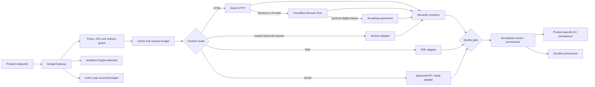
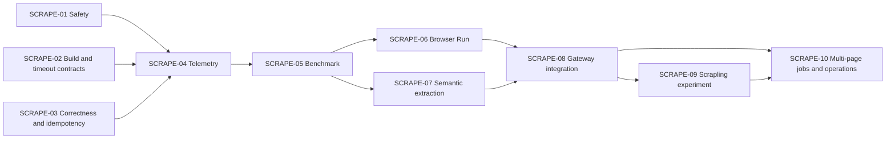

# ResearchTools scraping system roadmap

**Last updated:** 2026-08-31 · **Status:** 🔄 in progress · **Owner:** platform/backend

**Evidence and experiment design:** [`plans/2026-08-30-scraping-modernization.md`](plans/2026-08-30-scraping-modernization.md)

**Status legend:** ✅ complete · 🔄 in progress · ⬜ planned · ⛔ blocked · 🧪 experiment · 🗑️ retire

## Mission

Build one safe, observable, provenance-preserving scraping platform for every ResearchTools workflow. It must extract permitted public content reliably, distinguish access-policy failures from technical failures, use browser/provider resources only when they add measured value, and remain reversible as sites and dependencies change.

This roadmap is the delivery source of truth. The linked modernization plan contains the production evidence, technology research, and falsifiable hypotheses behind the ordering and adoption gates.

## Strategic decision

The system will evolve around a shared `ScrapeGateway`, not around individual endpoints adding more fallback code.

The default strategy is:

```text
policy + SSRF validation
  -> cache
  -> content-type/platform router
  -> direct HTTP
  -> semantic extraction
  -> conditional Cloudflare Browser Run
  -> optional, evidence-gated Scrapling strategy
  -> explicit archive retrieval
  -> quality gate + provenance + telemetry
```

Cloudflare Browser Run is the first rendering/crawling layer because it is already bound to the application. Trafilatura and Readability are benchmark candidates for semantic extraction. Scrapling is a pinned Container experiment and will become a production strategy only if it adds material recovery beyond the winning HTTP + Browser Run path.

Scrapling adaptive selectors are reserved for maintained, repeated-domain profiles. They are not the generic extractor for arbitrary one-off URLs.

## Non-negotiable boundaries

- Never bypass authentication, paywalls, CAPTCHA, robots exclusions, or publisher content-use signals.
- Never fetch private, reserved, link-local, metadata, or unsafe redirect destinations.
- Never put raw URLs, query strings, response bodies, prompts, cookies, tokens, IPs, or user agents in operational telemetry.
- Never accept a long login page, navigation shell, archive mismatch, or provider placeholder as successful article content.
- Never ingest a provider/crawl result twice because of polling, retries, or replay.
- Never deploy a new fetcher or extractor without a versioned corpus result, cost/latency evidence, a feature flag, and a rollback path.
- Preserve existing public API response contracts while endpoints migrate to the gateway.
- Treat live, supplied, provider, and archived content as distinct provenance modes.

## North-star outcomes

The first observability milestone establishes the baseline. Subsequent releases must meet these durable targets:

| Outcome | Target |
|---|---:|
| Terminal telemetry coverage | >=99% of scrape requests |
| Saved-result provenance coverage | 100% |
| Redirect-aware SSRF coverage | 100% of caller-controlled outbound requests |
| Wrong/login/boilerplate content accepted | <=2% of labeled samples |
| Valid short documents incorrectly rejected | <=5% of labeled samples |
| Eligible hard-failure reduction | >=40% relative to the measured baseline |
| p95 total scrape latency regression | <=25% unless the approved recovery benefit is achieved |
| Duplicate provider/crawl ingestion | 0 |
| New raw URLs written to operational logs | 0 |
| Candidate rollback time | configuration/feature-flag change; no code rollback required |

Cost targets are recorded per successful document and set after the baseline. The initial Browser Run experiment has a go/no-go ceiling of `$0.001` per recovered document.

## Target architecture



Product endpoints remain responsible for product-specific AI and presentation. They no longer own URL safety, headers, retries, timeouts, rendering, extraction, quality, provider routing, or telemetry.

## Delivery dependency map



## Milestone 0 — Safety and correctness foundation

**Priority:** P0 · **Status:** 🔄 in progress · **Issues:** `SCRAPE-01`, `SCRAPE-02`, `SCRAPE-03`

### Deliverables

- [x] Inventory 26 caller-controlled outbound entry points and assign target adapters in [`operations/SCRAPING_FETCH_INVENTORY.md`](operations/SCRAPING_FETCH_INVENTORY.md).
- [ ] Add one shared safe-URL/request primitive:
  - HTTP(S) only
  - no embedded credentials
  - explicit allowed-port policy
  - canonical IPv4/IPv6 parsing
  - private/reserved/link-local/metadata range denial
  - DNS result validation and rebinding defense at the egress boundary
  - `redirect: manual` with validation at every hop
  - redirect, response-byte, content-type, and total-duration limits
- [ ] Enforce the same rules again inside Browser Run and Container service boundaries.
- [ ] Route public survey/COP URL enrichment through the safe primitive.
- [ ] Route `tools/analyze-url`, `scrape-metadata`, claims, timeline, RageCheck, AI scrape, social routes, and the web scraper through it.
- [x] Route `tools/scrape-metadata` through bounded text fetch and `tools/extract` through the bounded text/PDF document adapter.
- [x] Route `tools/analyze-url` and its optional Wayback metadata checks through bounded exact-host adapters; disable implicit archive-save writes from the read-like analysis request.
- [x] Route the shared content-intelligence PDF helper through bounded MIME/signature-validated PDF fetch.
- [x] Route content-intelligence analysis, saved-link titles/delegation, and the public Twitter image proxy through bounded purpose-specific adapters; disable dynamic rendering on the analysis path pending enforcing egress.
- [ ] Add binding-backed abuse throttling and write budgets to the public Twitter image proxy before promoting it for higher-volume use.
- [x] Scope `content-intelligence/analyze-url` `load_existing` reads to the authenticated analysis owner and require owner/editor/admin workspace authority for new writes.
- [x] Correct `enhancedFetch()` option typing, merged headers, abort propagation, total timeout, and bounded retry contract.
- [ ] Add all `functions/`, `workers/`, and Container TypeScript entry points to build/CI validation. The current `type-check:scraping-surface` covers 24 inventoried roots with one explicit exclusion.
- [x] Correct the web-scraper dataset authentication/response contract and final-redirect provenance.
- [ ] Rename the metadata-completeness score so it is not represented as source reliability.
- [x] Reserve paid COP scrape requests before Apify, bind runs to authenticated user/workspace/session, enforce editor/admin/owner writes, and validate ownership when polling.
- [x] Add trusted provider item identity and idempotent evidence ingest semantics with a managed local-D1 migration.
- [x] Replace content-intelligence extraction-failure raw URL/reason context with dedicated-key URL/domain identifiers, opaque correlation, and normalized errors; omit identifiers when the key is unavailable.

### Required tests

- URL parsing variants, numeric/encoded IPs, IPv4-mapped IPv6, localhost/reserved ranges
- direct and multi-hop redirect to a denied destination
- DNS answer change/rebinding simulation at the egress boundary
- response-size and redirect-count termination
- deterministic abort propagation
- cross-user/workspace analysis read denial
- repeated provider poll/retry creates no duplicate evidence
- public URL enrichment cannot reach a denied destination

### Exit gate

Every known caller-controlled outbound request uses the shared guard, Worker code type-checks, retries are bounded, repeated ingestion is idempotent, and no new raw URL enters `event_logs`.

### Enforcing-egress decision gate

The Cloudflare-native candidate is a service-only scraping Worker whose public egress is routed through [Workers VPC](https://developers.cloudflare.com/workers-vpc/configuration/vpc-networks/) and an account-scoped [Gateway L4 policy](https://developers.cloudflare.com/cloudflare-one/traffic-policies/network-policies/). It is not accepted from code review or DNS tests alone. Before activation, a live rebinding experiment must show that mixed A/AAAA, TTL-zero answer changes, redirects, IPv6 variants, and a private canary all produce zero private connections while Gateway records the actual denied destination IP. If any connection bypasses Gateway or reaches the canary, use a dedicated external proxy/firewall boundary instead.

Dynamic Browser Run navigation remains disabled as a safety target until its top-level navigation, redirects, frames, workers, WebSockets, and every subresource are demonstrably forced through the same enforcing boundary. Offline rendering of already bounded HTML is the interim candidate when browser-based conversion materially improves the benchmark.

## Milestone 1 — Observable baseline

**Priority:** P0 · **Status:** ⬜ planned · **Issue:** `SCRAPE-04`

### Deliverables

- [x] Define versioned `ScrapeRequest`, `ScrapeResult`, `ScrapeAttempt`, provenance, quality, normalized-error, and privacy-safe metric contracts. Route adoption and the production sink remain pending.
- [ ] Add a `SCRAPE_ANALYTICS` Workers Analytics Engine binding to Pages and scraping Workers/Containers.
- [ ] Emit one non-blocking metric per attempt and exactly one terminal metric per request.
- [ ] Add correlation IDs across Pages -> Browser Run/Container -> provider calls.
- [ ] Instrument direct fetch, renderer, parser, provider, archive, cache, PDF, social, and AI stage timings.
- [ ] Capture Browser Run `X-Browser-Ms-Used`/crawl browser seconds and estimate cost.
- [ ] Persist `source_mode`, fetch strategy, extractor/quality version, bounded attempt summary, quality score, and content hash with saved analyses.
- [ ] Enable sampled persisted structured logs for the standalone browser-renderer Worker.
- [ ] Keep D1 `event_logs` for security events, actionable errors, and upstream outages only.
- [ ] Add dashboard queries for:
  - requests and success by endpoint/strategy/page class
  - normalized failures and HTTP status class
  - fallback recovery chains
  - p50/p95 total and stage latency
  - quality rejection and manual false-success rate
  - cache hit and retry amplification
  - browser/provider seconds and cost per success
  - social/provider health and duplicate ingestion prevented
- [ ] Produce a daily aggregate health report and alert rules.

### Initial alert policy

- success rate drops by >=15 percentage points after minimum volume
- p95 latency doubles
- provider 401/403/429 rate spikes
- browser/provider budget is exceeded
- terminal metric coverage drops below 99%
- any SSRF/redirect denial occurs after the initial gateway validation
- duplicate ingestion is attempted or a uniqueness guard fires unexpectedly

### Exit gate

Collect at least 14 days and 100 terminal failures with >=99% terminal coverage. Evaluate hypotheses H1, H7, and H9 from the evidence plan. Do not use retained `content_analysis` rows as the success denominator.

## Milestone 2 — Reproducible scraper benchmark

**Priority:** P1 · **Status:** ⬜ planned · **Issue:** `SCRAPE-05`

### Corpus

- [ ] Build a versioned 200-300 page corpus using permitted/public content.
- [ ] Cover static articles, JavaScript shells, public WAF-blocked pages, valid short documents, PDFs, multilingual pages, structured documents, social URLs, and archive snapshots.
- [ ] Save sanitized HTML for extractor replay; keep live-fetch tests separate and polite.
- [ ] Reserve a held-out set and refresh part of it periodically.
- [ ] Human-label main content, title, author, publication date, content identity, page class, and expected policy outcome.

### Candidate adapters

- [ ] Current `extractArticle` implementation
- [ ] Trafilatura
- [ ] Mozilla Readability with a compatible DOM runtime
- [ ] Cloudflare Browser Run + each semantic extractor
- [ ] Scrapling `Fetcher`, `DynamicFetcher`, and `StealthyFetcher` on eligible cohorts only

### Scorecard

- hard success and false success
- main-text precision, recall, macro F1, and output distribution
- metadata field F1
- boilerplate/duplication and structure preservation
- p50/p95 fetch, render, and extraction latency
- bytes, retries, browser seconds, Container resources, and cost per success
- repeat-run stability
- policy-correct outcomes

### Exit gate

Publish a paired comparison with 95% confidence intervals and explicit decisions for hypotheses H2-H6 and H8. No candidate advances based on repository popularity or a single demonstration URL.

## Milestone 3 — Modern extraction core

**Priority:** P1 · **Status:** ⬜ planned · **Issues:** `SCRAPE-06`, `SCRAPE-07`

### Direct HTTP and retry policy

- [ ] Use one stable, internally coherent HTTP client policy.
- [ ] Test the existing random browser-profile behavior; remove it unless it improves direct-fetch success by a material amount without raising block/rate responses.
- [ ] Honor `Retry-After`, use jittered per-domain backoff, and prevent multiple endpoints from amplifying retries.
- [ ] Cache only successful, policy-valid results with content-type-aware TTLs.

### Semantic extraction and quality

- [ ] Adopt the benchmark-winning semantic extractor or improve the current extractor if no candidate clears the gate.
- [ ] Introduce a versioned, content-type-aware quality score using body length, boilerplate ratio, duplication, login/paywall markers, title/body coherence, and structure signals.
- [ ] Preserve Markdown structure, tables, lists, and code only where benchmark/user requirements justify it.
- [ ] Return rejection reasons suitable for routing and user guidance.

### Browser Run

- [ ] Keep static-first as the default unless H4 is falsified.
- [ ] Render 2xx JavaScript shells/thin bodies and eligible public 403s.
- [ ] Never render around 401, robots/content-signal denial, CAPTCHA, or other policy outcomes.
- [ ] Re-run semantic extraction and quality validation on rendered content.
- [ ] Enforce per-request time/browser limits and a monthly budget.
- [ ] Roll out to 5%, 25%, then 100% of eligible fallback requests.

### Archive behavior

- [ ] Split live and historical retrieval into distinct modes.
- [ ] Require explicit archive selection or a product policy that exposes it clearly.
- [ ] Persist snapshot URL/time and verify identity before analysis.
- [ ] Remove “bypass” terminology from API/UI/docs.

### Exit gate

The winning path clears its benchmark gates, eligible hard failures improve by at least 40% relative to baseline, false success remains <=2%, and latency/cost remain inside release limits.

## Milestone 4 — Shared gateway and product integrations

**Priority:** P1 · **Status:** ⬜ planned · **Issue:** `SCRAPE-08`

### Gateway contract

```text
ScrapeRequest
  url, purpose, mode, content/crawl limits, user/workspace context

ScrapeResult
  outcome, normalized error, content, metadata, provenance,
  attempts, quality, timings, cost, cache and policy results
```

### Integration matrix

| Consumer | Gateway mode | Product responsibility after migration | Acceptance criterion |
|---|---|---|---|
| Content Intelligence | full article/PDF/social | AI summary, entities, topics, claims, persistence | Existing response contract preserved; provenance stored. |
| Web Scraper page | metadata/full/summary | Dataset creation and presentation | Real timeout works; shared quality/error taxonomy. |
| Citation generator | metadata | Citation formatting | Title/author/date extraction uses gateway; no duplicate scraper. |
| AI URL Scraper / Starbursting | article text | Framework-specific AI | Shared cache/fetch/extraction; existing framework output preserved. |
| Claims extraction | article text | Claim/entity AI | No archive/provider mismatch hidden from user. |
| Timeline extraction | article text | Timeline AI | Same safety, timeout, and quality behavior as Content Intelligence. |
| RageCheck | article text | Manipulation analysis | No direct `scrapeUrl()` path remains. |
| Survey/COP public intake | safe quick metadata/article | Background enrichment and storage | Public SSRF tests pass; failure is non-blocking and observable. |
| Social extraction | social adapter | Platform presentation/download options | Approved provider provenance and provider health recorded. |
| COP scraper | owned async provider job | Evidence transformation | Polling/retry is idempotent and session-bound. |
| Batch/agentic collection | batch metadata/article | Approval and promotion workflow | Per-domain budgets and terminal metrics apply. |

### Migration method

1. Add gateway adapter behind the existing route.
2. Run contract tests against the old public response shape.
3. Canary strategy selection without dual-fetching a publisher.
4. Remove duplicated fetch/extraction code after parity and telemetry verification.
5. Deprecate genuinely unused routes only after 30 days of route metrics and a compatibility window.

### Exit gate

One implementation owns URL policy, fetch, retry, rendering, extraction, fallback, quality, provenance, and telemetry. Product adapters contain only product-specific transformation, AI, and persistence.

## Milestone 5 — Scrapling integration experiment

**Priority:** P2 / experimental · **Status:** 🧪 planned · **Issue:** `SCRAPE-09`

### Container boundary

- [ ] Build a dedicated least-privilege Cloudflare Container; do not couple browser dependencies to the OSINT agent.
- [ ] Pin the exact Scrapling and browser dependency versions with hashes.
- [ ] Expose only authenticated internal operations required by the gateway.
- [ ] Do not expose a public MCP server, arbitrary CDP URLs, user-data directories, filesystem paths, or unrestricted browser automation.
- [ ] Repeat URL/redirect/DNS policy enforcement inside the Container.
- [ ] Cap memory, tabs, page time, response bytes, redirects, concurrency, and per-domain rate.
- [ ] Record Container resource/cost and structured attempt telemetry.

### Strategy experiments

- [ ] `Fetcher`/TLS impersonation on residual eligible direct-fetch failures
- [ ] `DynamicFetcher` on residual JavaScript failures
- [ ] `StealthyFetcher` only on approved public sources and never for policy denial
- [ ] Spider sessions only for a demonstrated multi-page/session need
- [ ] Adaptive relocation on at least three repeated-domain profiles

### Promotion gates

General fallback promotion requires:

- >=10 absolute percentage points additional recovery after HTTP + Browser Run
- <=2x p95 latency
- <=2% false-success
- stable repeated runs and bounded Container cost
- zero policy-boundary violations
- upgrade regression suite passing with exact version pin

Adaptive selector promotion additionally requires >=50% fewer selector breakages and <2% wrong-element relocation. Store fingerprints in an external persistent store rather than depending on local Container SQLite lifecycle.

### Exit gate

Publish an adopt/defer decision. If the gates fail, keep Scrapling out of the general production path; domain-specific modes may still ship independently if they clear their own gates.

## Milestone 6 — Multi-page collection and crawl jobs

**Priority:** P2 · **Status:** ⬜ planned · **Issue:** `SCRAPE-10`

### Deliverables

- [ ] Create owned, cancellable, expiring crawl-job records.
- [ ] Make polling and result ingestion idempotent.
- [ ] Pilot Cloudflare Browser Run `/crawl` before adding another crawler orchestrator.
- [ ] Default to `render: false`; render only page classes proven to need it.
- [ ] Declare only required crawl purposes (`search` and/or `ai-input`).
- [ ] Require maximum pages, depth, include/exclude patterns, allowed domains/subdomains, bytes, duration, browser seconds, and cost.
- [ ] Record disallowed/skipped pages, final URLs, content-signal decisions, and partial completion.
- [ ] Add cancellation, expiration cleanup, retry/circuit-breaker behavior, and operator controls.
- [ ] Evaluate Crawlee or Scrapling spiders only if `/crawl` misses a documented queue/session/proxy requirement.

### Exit gate

Every job has an owner, limits, cancellation, provenance, cost accounting, terminal state, and duplicate-safe ingestion. A hostile or accidental seed cannot cause unbounded discovery.

## Milestone 7 — Operations, upgrades, and documentation

**Priority:** continuous · **Status:** ⬜ planned

### Operations

- [ ] Scraper health dashboard and daily aggregate report
- [ ] Provider/browser/Container budgets and circuit breakers
- [ ] Runbooks for access spikes, renderer/provider outage, bad extraction, queue backlog, duplicate prevention, and emergency strategy disable
- [ ] Weekly labeled quality sample and false-success review
- [ ] Monthly provider/dependency/security review
- [ ] Quarterly corpus refresh or sooner after a material engine upgrade
- [ ] Retention jobs for analytics, crawl jobs, caches, and bounded provenance attempts

### Upgrade policy

- Pin fetcher, browser, extractor, and provider adapter versions.
- Use an automated dependency PR, but never auto-deploy a scraper/browser major or breaking release.
- Run unit, contract, snapshot-corpus, held-out, security, and resource tests before promotion.
- Canary the new version by strategy flag and retain the prior version through the observation window.
- Record the benchmark delta, migration notes, known failures, and rollback flag in an upgrade decision record.
- For Scrapling, review every changelog between pinned versions and rebuild browser/fingerprint assets deliberately.

### Documentation

- [ ] One architecture document and gateway contract
- [ ] Generated/verified endpoint documentation for all thin adapters
- [ ] Error taxonomy and user-facing remediation guide
- [ ] Provider and content-policy matrix
- [ ] Local development and benchmark instructions
- [ ] Production deployment, dashboard, alert, budget, and rollback runbook
- [ ] Deprecation log for removed scraper implementations/routes
- [ ] Decision records for semantic extractor, Browser Run routing, Scrapling, and multi-page orchestrator

## Release gates

No milestone or strategy advances when any of the following is true:

- a private/reserved address or unsafe redirect can be fetched
- terminal telemetry coverage is below 99%
- incorrect/login/boilerplate acceptance exceeds 2%
- valid short-content rejection exceeds 5%
- p95 latency regresses by >25% without its agreed recovery benefit
- target-cohort hard success improves by <5 absolute percentage points
- provider/browser cost per success exceeds its budget
- 5xx rate rises by >2 absolute percentage points
- repeated poll/retry creates a duplicate
- policy denial is reclassified as a technical failure and routed through stealth
- the prior strategy cannot be restored by configuration

## Backlog explicitly deferred

- Broad proxy rotation or CAPTCHA-solving as a default platform feature
- Browser-first rendering for every URL
- A public Scrapling MCP/browser automation service
- Lightpanda production use while upstream remains beta/WIP
- Firecrawl, Zyte, or another managed scraping vendor without a measured internal SLO gap
- Crawlee or a custom crawler scheduler before bounded Browser Run `/crawl` is evaluated
- Automatic archive substitution without explicit provenance
- A one-shot rewrite of every existing endpoint

## Delivery checklist

| ID | Deliverable | Priority | Dependency | Status |
|---|---|---:|---|---|
| `SCRAPE-01` | Safe outbound URL/redirect primitive and coverage inventory | P0 | — | 🔄 |
| `SCRAPE-02` | Worker TypeScript build, timeout and request-option contracts | P0 | — | 🔄 |
| `SCRAPE-03` | Auth scoping, COP ownership/idempotency, dataset/score corrections | P0 | — | 🔄 |
| `SCRAPE-04` | Privacy-safe analytics, durable provenance, dashboard, alerts | P0 | 01-03 | ⬜ |
| `SCRAPE-05` | Versioned corpus, harness, candidates, paired decision report | P1 | 04 | ⬜ |
| `SCRAPE-06` | Browser Run routing, usage metering, budgets, canary | P1 | 05 | ⬜ |
| `SCRAPE-07` | Semantic extractor and versioned quality scorer | P1 | 05 | ⬜ |
| `SCRAPE-08` | Shared gateway and all endpoint/product adapters | P1 | 06-07 | ⬜ |
| `SCRAPE-09` | Pinned Scrapling Container experiment and decision record | P2 | 08 | 🧪 |
| `SCRAPE-10` | Bounded multi-page jobs, `/crawl`, operations and runbooks | P2 | 08; 09 optional | ⬜ |

## Definition of roadmap completion

This roadmap is complete when:

1. Every scraper consumer uses the shared gateway.
2. Every caller-controlled fetch is redirect-aware and SSRF-safe at every execution boundary.
3. Every attempt is observable and every saved result has durable provenance.
4. The selected extraction/rendering path has passed the corpus and production canary gates.
5. Social, PDF, archive, browser, provider, and multi-page behaviors are explicit adapters with bounded costs.
6. Provider and crawl ingestion are owner-bound and idempotent.
7. Scrapling has a documented adopt/defer outcome based on additive value.
8. Duplicate legacy implementations are retired and endpoint contracts/documentation are current.
9. Operators can detect, diagnose, budget, disable, roll back, and safely upgrade every strategy.
