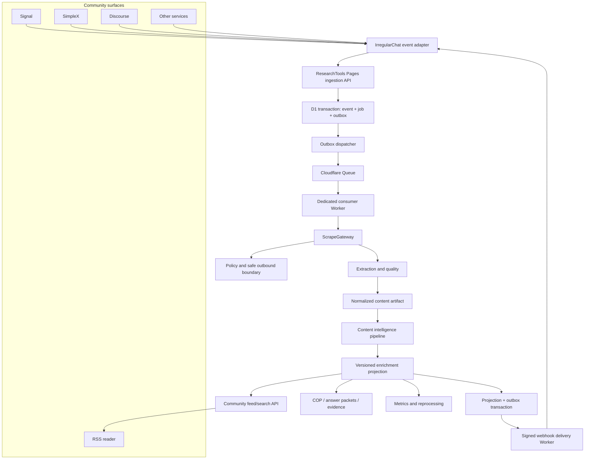

# ResearchTools community scraping and IrregularChat integration plan

**Date:** 2026-09-06

**Status:** reviewed; ready for Phase 0 contract freeze after the repository-baseline prerequisites below

**Owners:** ResearchTools platform, IrregularChat bot/RSS maintainers

**Depends on:** [ResearchTools scraping system roadmap](../SCRAPING_ROADMAP.md)

**Related contracts:** [Scraping API](../api/SCRAPING-API.md), [scraping observability](../operations/SCRAPING_OBSERVABILITY.md)

## Executive decision

ResearchTools becomes the shared community content-intelligence platform. It owns safe retrieval, content extraction, rendering and provider selection, normalization, enrichment, provenance, deduplication, reprocessing, crawl/feed jobs, and scraping analytics. IrregularChat owns messaging transports, community interaction, membership, moderation, and presentation.

IrregularChat should not maintain a second general-purpose scraper or independently reproduce ResearchTools analysis. Its local scraper remains temporarily as a measured fallback during migration, then narrows to transport-specific preview handling and emergency degradation.

The durable interaction is:

```text
Signal / SimpleX / RSS / Discourse / other community source
  -> IrregularChat observes a URL or feed event
  -> ResearchTools service API accepts an idempotent ingestion request
  -> ScrapeGateway retrieves and normalizes permitted public content
  -> versioned enrichment pipeline creates claims, entities, topics, 5W, and provenance
  -> signed event/webhook announces completion
  -> IrregularChat stores a small presentation projection and ResearchTools artifact reference
  -> RSS, search, COP, and bot commands reuse the same artifact
```

This is an API and ownership split, not a requirement that every user create an account.

- Guests may analyze public URLs ephemerally and receive unsaved results.
- Public community feeds may display service-owned, moderated community artifacts.
- A signed-in user is required to create personal bookmarks, retain private work, edit saved analyses, or collaborate in a workspace/team.
- Bot service credentials authorize community ingestion; they must never impersonate an end user or silently create a personal bookmark.

## Why this direction

ResearchTools already has the harder platform primitives:

- bounded outbound URL and redirect handling;
- SSRF and unsafe-destination protections;
- content-type and social-provider routing;
- extraction fallbacks with explicit provenance;
- anonymous ephemeral Content Intelligence analysis;
- workspace-scoped persistence authorization;
- content hashes, metadata, claims, entities, topics, sentiment, archive identities, and quality signals;
- scraping telemetry, normalized failures, and deployment runbooks;
- answer-packet and evidence-oriented data structures;
- public COM-B/BCW canon and recommendation APIs;
- COP workspaces and investigative artifacts.

Keeping equivalent logic in each bot, RSS application, and downstream service creates contract drift, duplicate AI cost, inconsistent safety policy, and weak provenance. Centralizing those responsibilities lets every community surface reuse one analyzed artifact while retaining independent user experiences.

The integration must extend existing ResearchTools contracts rather than create a parallel platform. In particular, it reuses `scrape.v1`, `source-artifact.v1`, `source-passage.v1`, `claim-evidence.v1`, `answer-packet.v1`, `osint.event.v1`, and `crawl.job.v1`. New community contracts are adapters and orchestration records around those foundations.

## Outcomes

### Macro outcomes

1. One community-wide content ingestion and enrichment plane.
2. One safe-fetch, policy, extraction, and provenance implementation.
3. One tenant-authorized artifact identity reused across bots, RSS, search, Discourse, COP, and investigations without cross-workspace disclosure.
4. Public exploration without forced login; authenticated persistence and collaboration.
5. Measurable quality, cost, latency, fallback recovery, and downstream value.
6. New communities and transports integrate through stable APIs rather than copying scraper code.

### Micro outcomes

- A URL posted once is not scraped or analyzed again by each consumer.
- Publication date reaches RSS and 5W instead of being replaced by first-shared time.
- Polymarket claim extraction and ranking use valid service authentication and endpoint limits.
- `!research`, COP, public BCW, content analysis, and behavior intake advertise availability truthfully.
- Every completed enrichment reports schema/model versions, content hash, extraction source, and quality.
- Every service request has an idempotency key and correlation ID.
- IrregularChat can show a useful partial result while deeper analysis completes asynchronously.
- Operators can identify authentication, policy, extraction, provider, quota, and contract failures without inspecting raw URLs.

## Priority and critical path

The program is intentionally narrower at the beginning than its final architecture.

| Horizon | Priority | Outcome | Explicitly deferred |
|---|---|---|---|
| Now | P0 | Durable plan baseline, authoritative IrregularChat Git baseline, frozen contracts, service identity, truthful capability discovery | Queues, webhooks, feeds, native 5W, scraper retirement |
| Next | P1 | One idempotent Signal source event reaches a ResearchTools artifact/projection in shadow mode and reconciles safely | Public feed migration and multi-page crawling |
| Then | P1 | RSS consumes publication date, provenance, and native evidence-backed 5W | General community onboarding |
| Later | P2 | Claims, Polymarket, unified search, Discourse, and COP reuse the same artifact | Local scraper deletion |
| Scale | P2 | Managed feed sources and a reusable community integration product | New providers without benchmark evidence |
| Retire | P3 | Redundant IrregularChat scraping/enrichment code is removed after measured fallback gates | Removing emergency preview/degraded mode |

The critical dependency chain is:

```text
durable roadmap + exact baselines
  -> contract and auth freeze
  -> service identity + capabilities
  -> transactional intake + durable job dispatch
  -> artifact/projection + reconciliation
  -> Signal shadow traffic
  -> RSS read migration
  -> secondary consumers
  -> managed feeds
  -> duplicate scraper retirement
```

No feed, COP, or local-scraper-retirement work should run ahead of the shadow-ingestion proof merely because those features can be implemented independently.

### Blocking fact register

| Fact still required | Blocks | Resolution owner/evidence |
|---|---|---|
| Authoritative IrregularChat remote/ref, Git metadata, full SHA, instructions, and runner | Any IrregularChat edit or cross-repository contract claim | Integration owner records fresh fetch, merge base/divergence, clean-worktree method, and exact commands |
| Accepted roadmap commit/milestone | All editing-worker dispatch | Integration owner records canonical containing SHA; do not use the pre-plan health-check SHA |
| Production-equivalent managed-migration prefix and hashes | New integration schema migration | Integration owner obtains read-only applied-state evidence and proves fresh/upgrade disposable D1 chains |
| Shared `ScrapeGateway` implementation/readiness against the main scraping-roadmap Milestone 4 contract | Tranche C fetch execution and later feed jobs | Platform owner provides joined SHA, focused/broad verification, feature flag, and rollback evidence; community routes must not build a private fallback ladder |
| ResearchTools Proxmox isolated checkout/ref | Claude implementation | Checksum-verified bundle/import, `claude:claude` ownership, clean unique branch, full-SHA equality |
| Queue/DLQ names, account availability, and approved cost limits | Tranche C deployment | Operator configuration record plus staging producer/consumer proof |
| Community-to-workspace/intake-investigation and source-channel visibility mapping | Service-client activation | Product/security owner approval and authorization fixtures |
| Retention/content-policy approval | Storing community passages beyond shadow evaluation | Product/legal policy decision recorded in operations documentation |
| Staging callback endpoint and secret-rotation owner | Webhook activation | Verified HTTPS callback policy, signature fixtures, and rotation runbook |

Unknown facts remain explicit blockers; workers must not invent them or silently substitute convenient defaults.

## Scope and non-goals

### In scope

- Single-URL community ingestion and analysis.
- Batch and RSS/Atom feed ingestion.
- Bounded multi-page collection for explicitly configured community sources.
- Article, public social-post metadata, PDF, repository, and supported media adapters.
- Reusable content intelligence, claim extraction/matching, 5W, research-question, BCW, and COP handoffs.
- Service identities, workspaces, quotas, events, webhook delivery, and operational analytics.
- Migration of IrregularChat Signal, SimpleX, RSS, unified search, Discourse, COP, and Polymarket integrations.

### Non-goals

- Bypassing authentication, paywalls, CAPTCHA, robots exclusions, or publisher content-use controls.
- Turning a service credential into a user session.
- Persisting anonymous analysis by default.
- Moving Signal/SimpleX membership, message handling, or community moderation into ResearchTools.
- Making ResearchTools the source of truth for personal reactions, chat messages, or social membership.
- Guaranteeing extraction from every website.
- Preserving every legacy response shape indefinitely.

## Current-state findings to resolve

| Area | Current condition | Required direction |
|---|---|---|
| Capability checks | Base URL is treated as proof that authenticated features work | Discover and gate each capability independently |
| Signal/SimpleX analysis | Shared client calls anonymous Content Intelligence successfully and falls back locally | Move to idempotent service ingestion and asynchronous completion |
| RSS | Reads bot-stored enrichment and derives 5W locally | Consume a versioned ResearchTools projection with native publication date and 5W |
| Research questions | Endpoint requires auth but bot may advertise it with URL-only configuration | Require a service capability/token or mark unavailable |
| Polymarket | No auth headers; up to 60 candidates sent to a 25-candidate endpoint | Use shared service transport and batch/cap candidate ranking |
| COP | URL-only readiness, empty bearer token, default workspace `1` | Dedicated service identity and explicit workspace/session policy |
| Unified search | Router prompt includes ResearchTools but allowlist filters it out | Enable the source and use answer packets/artifact references |
| Response types | Client assumes fields/shapes not present in every mode | Publish and validate a versioned contract |
| Logging | Free-form console logs and `null` failures | Structured, privacy-safe outcomes and correlation |
| Provenance | Downstream projections omit analysis/model/extractor identity | Preserve artifact ID, content hash, schema, method, and quality |

### Interim repairs before platform migration

After the IrregularChat Git baseline is established, ship these bounded corrections without waiting for community ingestion:

1. Split readiness helpers into anonymous analysis, public BCW, authenticated research, claims, COP, behavior intake, and persistence capabilities.
2. Never emit an empty bearer header or default workspace `1`.
3. Authenticate existing Polymarket claim calls and cap/chunk candidates to the server-advertised limit of 25.
4. Add `researchtools` to unified-search router validation while retaining explicit intent and fallback behavior.
5. Correct the current Content Intelligence response type: optional ephemeral IDs, mode-dependent fields, `claim_analysis`, persistence status/notice, extraction quality, attempts, and cache optionality.
6. Preserve ResearchTools `publish_date` through the bot/RSS projection and render it separately from `first_posted_at`.
7. Use the server-returned COP share URL and require a real token/workspace policy before enabling COP.
8. Replace `null`-only failure collapse with normalized status/retryability while keeping existing user-facing fallbacks.

These are compatibility repairs, not permission to build more direct ResearchTools calls. New integration behavior must use the generated/schema-validated client and the v1 contracts below.

## Product and authorization model

### Access tiers

| Tier | Identity | Permitted behavior | Persistence |
|---|---|---|---|
| Guest | Anonymous/IP-budgeted | Analyze one permitted public URL, inspect public artifacts | None; ephemeral response/cache only |
| Community service | Scoped machine credential | Submit community URLs/events, read service-owned results, receive webhooks | Community workspace/artifact retention only |
| Signed-in user | User session/token | Save bookmarks, create private analyses, edit owned records | User/workspace scoped |
| Team collaborator | User plus workspace role | Share, edit, investigate, use COP and evidence workflows | Workspace scoped with role checks |
| Operator | Explicit administrative role | Source/profile administration, replay, quarantine, metrics | Audited operational writes |

### Boundary rules

- “Save bookmark” always requires an authenticated user and an authorized destination workspace.
- A bot may save a community artifact only to its configured service-owned community workspace.
- A community artifact is not a personal bookmark and does not appear as one unless a user explicitly saves it.
- Anonymous results cannot later become owned merely by guessing an ID; claiming/saving requires a signed-in user and an explicit copy/link action.
- Public feed visibility and source-message visibility are separate policies. Private group identifiers, sender identity, and message text must not leak into public ResearchTools records.
- Service tokens are audience-, scope-, community-, and environment-bound, with rotation and revocation support.

## Target platform architecture



### ResearchTools responsibilities

- URL normalization and canonical source identity.
- Fetch policy, SSRF/redirect enforcement, robots/content-use decisions, and quotas.
- Cache, retries, backoff, extraction strategy, rendering, provider adapters, and archives.
- Content-type routing for HTML, PDF, supported social URLs, feeds, repositories, and media metadata.
- Content hash deduplication and alias handling.
- Metadata, main text, publication information, links, entities, sentiment, topics, keyphrases, claims, manipulation indicators, and native 5W.
- Quality scoring, provenance, schema/model versions, and reprocessing.
- Transactional intake/outbox records, queue consumers, event delivery, webhook retries, dead letters, and reconciliation APIs.
- Community artifacts, feed/search projections, COP/evidence integration, and operational metrics.

### IrregularChat responsibilities

- Signal/SimpleX transport, commands, permissions, moderation, and rate limiting at the interaction layer.
- Detecting candidate URLs and attaching minimal community context.
- Generating stable source-event and idempotency identities.
- Showing queued/partial/complete/failure states to users.
- Storing community-local display projections, reactions, comments, and transport references.
- Choosing what becomes visible in RSS/Discourse and honoring source-community privacy.
- Providing a controlled local fallback during migration and service outages.

### Shared responsibility

- Contract tests and compatibility windows.
- User-facing disclosure of source, quality, and limitations.
- Abuse handling, deletion propagation, and retention policy.
- Incident response and cost budgets.
- A tested degraded mode when either service is unavailable.

### Function placement rule

Use this test whenever a new feature is proposed:

| Question | If yes |
|---|---|
| Does it fetch, render, extract, normalize, classify, enrich, deduplicate, cite, archive, reprocess, or assess quality for external content? | Implement once in ResearchTools behind the gateway/artifact contracts |
| Can two products reuse the result without community-specific presentation state? | Store/version it in ResearchTools and expose a projection |
| Does it depend on Signal/SimpleX group membership, sender permissions, reactions, moderation, or message delivery? | Keep it in IrregularChat |
| Is it a personal save, edit, or collaboration action? | Keep user interaction in the client, enforce ownership/workspace persistence in ResearchTools |
| Is it only a short transport preview needed during an outage? | Allow a bounded IrregularChat degraded path, label it non-authoritative, and meter it |
| Does it require a platform-specific credential/provider? | ResearchTools owns the adapter and policy unless the credential is intrinsically tied to the messaging transport |

IrregularChat integrates through one anti-corruption layer—the generated/schema-validated community client. Product code must not construct ResearchTools auth/workspace headers, duplicate endpoint-specific response types, or call scraping providers directly.

### Runtime boundary

Pages Functions remain the HTTP producer surface. Durable ingestion and delivery processing run in separate queue-consumer Workers; Pages Functions do not consume queues. Cloudflare Queues is treated as at-least-once delivery, so every consumer operation is idempotent and state transitions use compare-and-set predicates. A dead-letter queue is mandatory because messages that exhaust retries without one can be discarded.

D1 and queue publication cannot be one atomic operation. The ingestion API therefore commits the source event, job, and an outbox row in one D1 `batch()` transaction before returning `202`. A best-effort `waitUntil` pump may reduce latency, but a scheduled dispatcher is the recovery authority. The dispatcher may publish the same outbox message more than once; the consumer deduplicates using the durable job ID and allowed state transition.

Platform basis: Cloudflare documents [Pages queue producers and the separate consumer-Worker boundary](https://developers.cloudflare.com/pages/functions/bindings/#queue-producers), [at-least-once Queue delivery](https://developers.cloudflare.com/queues/reference/delivery-guarantees/), [dead-letter behavior](https://developers.cloudflare.com/queues/configuration/dead-letter-queues/), and transactional rollback for [D1 `batch()`](https://developers.cloudflare.com/d1/worker-api/d1-database/#batch).

## Core domain model

### Source event

An immutable observation that a community surface encountered a URL.

```ts
interface CommunitySourceEventV1 {
  schemaVersion: 'community-source-event.v1'
  communityId: string
  sourceSystem: 'signal' | 'simplex' | 'rss' | 'discourse' | 'api'
  sourceEventId: string
  observedAt: string
  url: string
  visibility: 'public' | 'community' | 'private'
  submitterRef?: string       // opaque, community-local reference
  sourceContextRef?: string  // opaque message/post reference
  requestedProducts?: Array<'content' | 'claims' | 'five-w'>
}
```

The event must not contain raw private chat text unless a separately authorized workflow explicitly requires it.

Research-question and COP creation are separate authenticated mutations against completed authorized artifacts. They are not implicit source-event products because they create higher-cost or collaborative state and need their own idempotency, scopes, and user-visible intent.

### Existing artifact foundation

Do not add `content-artifact.v1`. ResearchTools already has the stronger evidence model:

- `SourceArtifactV1` / `source_artifacts` for tenant-scoped canonical identity, metadata, content hash, and `ScrapeProvenanceV1`;
- `SourcePassageV1` / `source_passages` for bounded citable text;
- `ClaimEvidenceLinkV1` / `source_claim_links` for supports/contradicts/contextualizes relationships;
- `AnswerPacketV1` for source-grounded answers;
- nullable `content_analysis.source_artifact_id` and `evidence_items.source_artifact_id` links.

Each community service receives one workspace and one system-managed intake investigation. Community artifacts are persisted through that investigation so the existing non-null workspace/investigation authorization and foreign keys remain authoritative. The system investigation is an implementation container, not a personal bookmark and not a user-visible team investigation unless an authorized operator explicitly promotes it.

Deduplication is tenant-scoped. A canonical URL or content hash in one community workspace must not reveal the existence, metadata, or processing state of the same content in another workspace. Cross-tenant fetch/cache reuse may occur only through privacy-safe internal cache keys and must never merge ownership records.

Raw text remains in bounded source passages and is returned only to scopes that permit it. Most community consumers receive the enrichment projection, not full extracted text.

### Enrichment projection

```ts
interface CommunityEnrichmentV1 {
  schemaVersion: 'community-enrichment.v1'
  projectionVersion: number
  artifactId: string
  analysisId?: string
  contentHash: string
  status: 'partial' | 'complete' | 'failed' | 'policy_denied'
  title?: string
  summary?: string
  author?: string
  publishedAt?: string
  domain?: string
  entities?: Record<string, Array<{ text: string; count?: number; confidence?: number }>>
  topics?: Array<{ name: string; description?: string; confidence?: number }>
  keyphrases?: Array<{ phrase: string; score: number }>
  sentiment?: Record<string, unknown>
  claims?: Array<{
    id: string
    text: string
    category?: string
    confidence?: number
    supportingPassageIds?: string[]
  }>
  fiveW?: Partial<Record<'who' | 'what' | 'when' | 'where' | 'why', {
    answer: string
    confidence: number
    supportingPassageIds: string[]
  }>>
  archiveUrls?: Record<string, string>
  modelVersions: Record<string, string>
  provenanceSummary: Record<string, unknown>
  quality: Record<string, unknown>
  completedAt?: string
}
```

Every generated assertion that matters to research should be traceable to an artifact and, where practical, supporting passages.

New versioned integration contracts use camelCase on the wire to match the existing typed artifact, scrape, OSINT-event, crawl-job, and answer-packet contracts. Legacy endpoint adapters may continue returning snake_case during their compatibility window, but the new generated client must not expose both conventions for the same v1 endpoint.

## Frozen v1 integration decisions

These decisions are authoritative for the first three tranches. Changing one requires a documented contract revision and updated provider/consumer fixtures before parallel implementation resumes.

### Service authentication

- Add a dedicated `getIntegrationPrincipalFromRequest()` path. Do not pass service credentials to `getUserFromRequest()` because its legacy raw-bearer fallback can auto-provision a hash-auth guest.
- Service bearer tokens use the exact, case-sensitive `rt_svc_<client-id>.<secret>` grammar `^rt_svc_([a-z0-9][a-z0-9_-]{15,63})\.([A-Za-z0-9_-]{43})$`. The secret is 32 random bytes encoded as unpadded base64url; whitespace, padding, Unicode, extra dots, and oversized authorization values are rejected without normalization. An invalid credential with the reserved `rt_svc_` prefix returns `401` and never falls through to user, session, guest, or raw-hash authentication.
- Store only token identifier, keyed hash, creation/expiry/revocation times, and last-used metadata. Show plaintext once at creation. Support overlapping current/next tokens for rotation.
- Each client has at most two token slots, `current` and `next`. Authentication loads and compares both slots without an early return. Hashes are `HMAC-SHA-256(INTEGRATION_TOKEN_HASH_KEY, "rt-service-token.v1\0" + clientId + "\0" + secret)` with a versioned marker and fixed-length comparison; the dedicated key is never reused for JWTs, telemetry, webhooks, or user hashes.
- One v1 client is bound to exactly one community, workspace, system intake investigation, environment, maximum visibility, and service principal. Multi-workspace access uses another client rather than a caller-selected workspace header.
- Persistent integration routes derive workspace and investigation from the service principal. They reject `X-Workspace-ID` when it conflicts; they never default to `1`.
- The service principal may satisfy existing `created_by` foreign keys but cannot create a browser session, sign in, own a personal workspace, or appear as a human collaborator.
- A service principal is a newly inserted dedicated user row; an existing human/guest row cannot be promoted to `service`. It uses deterministic `service_<client-id>` / `service+<client-id>@service.invalid` identity sentinels required by the historical production schema, has no routable mailbox, user/account hash, or OIDC identity, uses the non-login `SERVICE_AUTH_DISABLED` password sentinel, owns only its private `TEAM` service workspace, and is rejected by legacy JWT user routes.

Initial scopes are exact strings:

| Scope | Grants |
|---|---|
| `community.events.write` | Submit/retry source events for the bound community |
| `community.jobs.read` | Read status for jobs created by that client/community |
| `community.artifacts.read` | Read safe artifact metadata and permitted passages in the bound workspace |
| `community.projections.read` | Read current/allowed historical enrichment projections |
| `community.claims.execute` | Extract/match claims within advertised budgets |
| `community.research.execute` | Generate research questions from authorized artifacts/packets |
| `community.cop.write` | Create/link COP material under explicit server workspace policy |
| `community.behavior.write` | Persist bot-generated behavior analyses in the bound community workspace |
| `community.feeds.manage` | Create, pause, poll, and backfill bounded feed sources |
| `community.webhooks.manage` | Register, rotate, pause, and inspect callback delivery state |

No wildcard scope ships in v1. Capability discovery returns the intersection of token scope, server support, feature flags, workspace state, and remaining hard limits.

### Identity and idempotency

Three identities remain separate:

1. **Source-event identity:** `(integrationClientId, communityId, sourceSystem, sourceEventId)`; prevents one chat/feed observation from being ingested twice.
2. **Request idempotency:** `(integrationClientId, operation, Idempotency-Key)` plus a stable request fingerprint; makes transport retries return the original operation.
3. **Artifact identity:** tenant-scoped canonical source identity plus content hash; deduplicates retrieval/enrichment without collapsing distinct community observations.

`Idempotency-Key` is required for mutating integration endpoints, contains 16–128 visible ASCII characters, and is never derived solely from a URL. The stable fingerprint includes schema version, source identity fields, canonicalized URL, visibility, and sorted requested products; it excludes correlation ID and transport retry time.

`X-Correlation-ID` is a diagnostic identity, not idempotency or authorization. Accept only 16–128 characters matching `[A-Za-z0-9._:-]+`; reject other values and require clients to generate random opaque IDs rather than encode URLs, users, groups, or messages. ResearchTools generates its own `requestId` for every attempt and returns both identities.

- Same key and same fingerprint: return the existing resource/status with `deduplicated: true`; do no new fetch or AI work.
- Same key and different fingerprint: return `409 idempotency_conflict`; never overwrite or silently accept.
- Same source-event identity under a new idempotency key: return the existing event/job association as deduplicated.
- A deliberate reanalysis uses the reprocessing endpoint with an explicit reason and target stage version, not a random idempotency key.

### Durable state and transaction order

Add only the orchestration records not already represented by the evidence schema:

| Record | Purpose | Required uniqueness/invariant |
|---|---|---|
| `integration_clients` | Community/workspace/intake-investigation binding and status | One active identity record per client ID |
| `integration_client_tokens` | Rotatable hashed service credentials | Token identifier unique; secret never stored |
| `community_source_events` | Immutable community observations | Unique source-event identity tuple |
| `community_ingest_jobs` | State, requested products, artifact/projection refs | Unique operation idempotency tuple; compare-and-set transitions |
| `community_enrichment_versions` | Immutable projection versions | Unique `(artifact_id, projection_version)` and stage-version fingerprint |
| `integration_outbox` | Durable queue/webhook publication intent | Unique event ID; lease and retry metadata |
| `integration_webhook_subscriptions` | Bound callback configuration and secret versions | Callback origin/policy validated; one active logical subscription ID |
| `integration_webhook_deliveries` | Per-event delivery/reconciliation state | Unique `(subscription_id, event_id)` |

The managed migration number is assigned only after a fresh canonical fetch and migration audit. One worker owns all schema changes in a tranche; no other worker may add or renumber a migration.

Ingestion ordering is fixed:

1. Authenticate service principal, authorize scope, enforce visibility and budgets, validate schema/URL/idempotency, and compute fingerprint without writes.
2. In one D1 `batch()` transaction, insert-or-resolve the immutable source event, insert-or-resolve the job, and insert the `job.queued` outbox record.
3. Return `202` only after that transaction commits. Return the prior representation for a valid replay.
4. A dispatcher publishes pending outbox records to the queue and marks them published. Publication can repeat after a crash.
5. The queue consumer claims the job using a state/version compare-and-set. A duplicate or stale message becomes a measured no-op.
6. Each durable stage commits its result, job transition, and next outbox event together before acknowledging the queue message.
7. Terminal projection creation and the corresponding webhook event are committed together. Webhook transport happens later.

No correctness requirement depends exclusively on `waitUntil`, free-form `console` logging, or exactly-once queue delivery.

### State machines

Ingest jobs use:

```text
accepted -> queued -> fetching -> enriching -> completed
                         |            |
                         v            v
                       failed       partial -> completed

accepted|queued|fetching|enriching|partial -> cancelled
any non-terminal state -> policy-denied
```

`completed`, `failed`, `cancelled`, and `policy-denied` are terminal for that job version. Retryable stage failure returns the job to `queued` with an incremented attempt and future `availableAt`; it does not pass through terminal `failed`. Reprocessing creates a new job linked by `supersedesJobId` and never reopens a terminal job.

Projection versions are immutable. One pointer identifies the current version; consumers may request a specific historical version while authorized. A failed reprocessing job leaves the prior current projection intact.

### Visibility and tenant isolation

Visibility is a non-promoting lattice: `private` is more restrictive than `community`, which is more restrictive than `public`. Effective visibility is the most restrictive of client maximum, configured source/channel policy, submitted event, artifact, and destination product.

| Visibility | Artifact/projection access | Source context exposure |
|---|---|---|
| `private` | Bound service and explicitly authorized workspace users | Opaque local reference only; never public feed/search |
| `community` | Bound community service and authorized community/workspace viewers | Opaque local reference; no sender/message content |
| `public` | Public projection endpoint may expose approved artifact-derived fields | No submitter, group, message, or private source reference |

An automated process may lower visibility but cannot promote it. Promotion to public requires an explicitly authorized moderation action with an audit record. Saving a public/community artifact to a personal workspace creates an authorized reference/copy; it does not change the original artifact's visibility or ownership.

### Error contract

All new integration endpoints return `integration-error.v1` on failure:

```json
{
  "schemaVersion": "integration-error.v1",
  "requestId": "req-...",
  "correlationId": "opaque-client-value",
  "error": {
    "code": "scope_denied",
    "message": "The credential cannot perform this operation.",
    "retryable": false
  }
}
```

The bounded v1 codes are:

| HTTP | Codes | Retry rule |
|---:|---|---|
| 400 | `invalid_request`, `invalid_schema`, `invalid_idempotency_key` | Fix request |
| 401 | `authentication_required`, `invalid_service_token`, `expired_service_token` | Refresh/rotate credentials; no automatic hot loop |
| 403 | `scope_denied`, `workspace_denied`, `visibility_denied` | Configuration/operator action |
| 404 | `not_found` | Terminal; do not reveal cross-tenant existence |
| 409 | `idempotency_conflict`, `state_conflict`, `version_conflict` | Reconcile existing resource before retry |
| 413 | `payload_too_large` | Reduce payload |
| 422 | `unsupported_target`, `policy_denied`, `quality_rejected` | Terminal unless input/policy changes |
| 429 | `rate_limited`, `budget_exhausted` | Honor `Retry-After` |
| 500 | `internal_error` | Bounded retry with jitter |
| 503 | `dependency_unavailable`, `auth_datastore_unavailable`, `queue_unavailable` | Bounded retry with jitter |

Unsupported HTTP methods use `405 method_not_allowed` with an `Allow` header. A disabled integration feature authenticates a valid service identity but reports every service capability false; it does not silently treat that service as an anonymous caller.

Errors never contain stack traces, SQL/provider bodies, secrets, raw private URLs, or cross-tenant identifiers. Existing `NormalizedScrapeError` remains nested in authorized job detail where applicable rather than being replaced by this API-level taxonomy.

### Webhook envelope and verification

V1 uses HMAC-SHA-256. Sign the exact bytes `timestamp + "." + rawRequestBody` and send:

- `X-ResearchTools-Event`: bounded event type;
- `X-ResearchTools-Event-ID`: immutable event ID;
- `X-ResearchTools-Delivery-ID`: unique attempt/delivery ID;
- `X-ResearchTools-Timestamp`: Unix seconds;
- `X-ResearchTools-Signature`: `v1=<lowercase hex digest>`.

Consumers reject timestamps outside a five-minute replay window, compare signatures in constant time, and deduplicate by event ID before applying a monotonic per-artifact `sequence`/`projectionVersion`. Event IDs are unique and time-sortable but are not treated as a globally gap-free sequence.

Webhook delivery is an optimization, not the source of truth. A signed event contains the minimal safe projection or resource reference. The reconciliation API is authoritative after missed, delayed, duplicated, or reordered delivery. Current and previous secrets may overlap during a bounded rotation window.

### Guest and saved-data behavior

- Existing anonymous Content Intelligence remains synchronous/ephemeral and subject to its public budget.
- Anonymous requests cannot call community ingestion, supplied-content, feed management, COP writes, reprocessing, or webhook administration.
- Anonymous cache entries are operational acceleration only: they create no user-visible saved record or ownership claim and expire under the public cache policy.
- “Save bookmark,” personal history, private retention, editing, and team collaboration continue to require an authenticated user and writable workspace.
- A community service artifact is retained under the community policy, not represented as a guest/user bookmark, and cannot be reassigned to a person without an explicit authenticated action.

## API surface to build

### 1. Capability discovery

`GET /api/integrations/capabilities`

Returns capabilities for the presented identity, not merely deployed routes:

```json
{
  "schemaVersion": "integration-capabilities.v1",
  "requestId": "req-...",
  "correlationId": "opaque-client-value",
  "identityType": "service",
  "communityId": "community-...",
  "workspaceId": "workspace-...",
  "contractVersions": {
    "capabilities": "integration-capabilities.v1"
  },
  "scopes": ["community.events.write", "community.projections.read"],
  "capabilities": {
    "anonymousAnalysis": true,
    "publicBcw": true,
    "communityIngest": false,
    "jobStatus": false,
    "artifactRead": false,
    "projectionRead": false,
    "persistentWorkspace": false,
    "researchQuestions": false,
    "cop": false,
    "behaviorIntake": false,
    "claimMatch": false,
    "feedJobs": false,
    "webhookManagement": false
  },
  "limits": {}
}
```

Anonymous calls return only public capabilities. Any supplied but unsupported or invalid authorization fails closed instead of becoming anonymous. All capability responses use `Cache-Control: no-store`; IrregularChat may retain a successful authenticated result in process for at most 60 seconds. After expiry, a failed refresh makes authenticated commands unavailable until a refresh succeeds. Anonymous analysis and public BCW are gated independently and do not inherit a stale authenticated capability result.

Capability names map one-to-one to the exact scopes listed above: `communityIngest`, `jobStatus`, `artifactRead`, `projectionRead`, `researchQuestions`, `cop`, `behaviorIntake`, `claimMatch`, `feedJobs`, and `webhookManagement` require the corresponding scope in table order. `persistentWorkspace` has no scope of its own and reports only whether an executable persistent integration surface is enabled for the valid binding. Every service capability is false in Tranche A because no service-consuming operation ships in that tranche; the endpoint establishes identity and reports that truth. A capability becomes true only when compiled server support, the exact integration feature flag, required bindings, valid client/workspace/investigation state, its exact scope, and any authoritative budget all agree. Associated contract versions and nonzero limits are omitted while the capability is false.

### 2. Community ingestion

`POST /api/integrations/community/v1/events`

- Requires a scoped service credential.
- Requires `Idempotency-Key` and `X-Correlation-ID`.
- Returns `202` only after the event/job/outbox transaction commits:

```json
{
  "schemaVersion": "community-ingest-accepted.v1",
  "requestId": "req-...",
  "correlationId": "opaque-client-value",
  "sourceEventId": "event-...",
  "jobId": "job-...",
  "artifactId": null,
  "status": "queued",
  "deduplicated": false
}
```

- Deduplicates the source event independently from content hash deduplication.
- Accepts requested products and an optional callback subscription reference.
- Never creates a personal bookmark.
- Returns the existing identifiers and current status for a valid replay; an artifact ID may be populated when a cached tenant-authorized artifact was resolved.

### 3. Result retrieval

- `GET /api/integrations/community/v1/jobs/{job_id}`
- `GET /api/integrations/community/v1/artifacts/{artifact_id}/projection`
- `POST /api/integrations/community/v1/artifacts:resolve` for bounded bulk reconciliation
- `POST /api/integrations/community/v1/artifacts/{artifact_id}:reprocess` for an explicitly authorized, versioned rerun

Responses use the frozen state/error taxonomies and support conditional requests with strong ETags derived from resource ID plus immutable version. Bulk reconciliation is bounded and cursor-based; it accepts known artifact/projection versions and returns only changed, deleted, or unauthorized-safe `not_found` results.

### 4. Signed events and webhooks

Management endpoints require `community.webhooks.manage`:

- `POST /api/integrations/community/v1/webhook-subscriptions`
- `GET /api/integrations/community/v1/webhook-subscriptions/{id}`
- `POST /api/integrations/community/v1/webhook-subscriptions/{id}:rotate-secret`
- `POST /api/integrations/community/v1/webhook-subscriptions/{id}:pause`
- `POST /api/integrations/community/v1/webhook-subscriptions/{id}:replay` with bounded event/time range and audit reason

Events:

- `artifact.accepted`
- `artifact.enrichment.partial`
- `artifact.enrichment.completed`
- `artifact.failed`
- `artifact.policy_denied`
- `artifact.reprocessed`
- `artifact.deleted`

Delivery requirements:

- The frozen HMAC-SHA-256 signature and five-minute replay window above.
- Unique event and delivery IDs, schema version, per-artifact sequence, projection version, and correlation ID.
- At-least-once delivery with idempotent consumers.
- Exponential backoff, maximum age, dead-letter visibility, and replay controls.
- Webhook payloads contain references and safe projections, not unrestricted raw content.

### 5. Batch and feed ingestion

- `POST /api/integrations/community/v1/batches`
- `POST /api/integrations/community/v1/feed-sources`
- `GET /api/integrations/community/v1/feed-sources/{id}`
- `POST /api/integrations/community/v1/feed-sources/{id}:poll`
- `POST /api/integrations/community/v1/feed-sources/{id}:pause`

Feed sources require explicit ownership, visibility, polling interval, item/page budgets, retention, and allow/deny rules. Use conditional GET, feed item GUID plus canonical URL identity, bounded concurrency, and per-domain backoff.

ResearchTools should parse and enrich feeds; IrregularChat decides which configured community sources and resulting items are shown.

### 6. Claims and matching

Replace endpoint-specific client code with authenticated, versioned service contracts:

- `POST /api/integrations/community/v1/claims:extract`
- `POST /api/integrations/community/v1/claims:match`

The match response must advertise/enforce candidate limits. The shared client chunks candidates, merges scores deterministically, and records method/version. Prefer matching an existing `artifactId` so extraction is not repeated.

### 7. Native 5W

Add a 5W enrichment stage operating on the normalized artifact and passages. Each dimension returns answer, confidence, evidence passages, model version, and `not_enough_evidence` where appropriate.

Do not substitute:

- first-shared date for publication/event time without an explicit label;
- topic descriptions for causation;
- named-entity presence for actor responsibility.

### 8. Answer packets, COP, and research questions

- Research questions should accept an existing artifact or a set of answer-packet references.
- COP creation for community breakouts should use a service-authorized template and a dedicated session workspace, not a hard-coded workspace ID.
- Evidence, claims, RFIs, and hypotheses should retain the originating artifact, source event, and passage references.
- Public share links must use the URL returned by ResearchTools, not a client-constructed route.
- Public framework canon stays public; saved behavior analyses and collaborative edits retain their existing authentication boundary.

### Target code topology

Keep transport, domain contracts, persistence, and background processing separable:

```text
functions/api/integrations/
  capabilities.ts
  community/v1/events.ts
  community/v1/jobs/[id].ts
  community/v1/artifacts/[id]/projection.ts
  community/v1/artifacts/resolve.ts

functions/api/_shared/
  integration-contract.ts
  service-auth.ts
  community-ingest-repository.ts
  integration-outbox.ts
  webhook-contract.ts

workers/community-jobs/
  src/index.ts                 # queue consumer + scheduled outbox recovery
  wrangler.toml

schema/managed-migrations/
  00xx_community_integration.sql

tests/e2e/smoke/
  community-integration-contract.spec.ts
  community-service-auth.spec.ts
  community-ingest-idempotency.spec.ts
  community-outbox-delivery.spec.ts
  community-tenant-isolation.spec.ts
```

These are target ownership seams, not permission to choose a migration ordinal early. `wrangler.toml`, lockfiles, shared schema exports, and migration numbering remain integration-owner paths because they are high-conflict joins.

## Processing pipeline

### Fast path

Target: useful acknowledgement or cached projection in under two seconds.

1. Authenticate and rate-limit the service identity.
2. Validate schema, scope, visibility, URL, idempotency, and request budget.
3. Normalize the URL and resolve an existing tenant-authorized URL alias/artifact if known. A new content hash cannot be known until retrieval or supplied-content hashing.
4. Commit event, job, and outbox intent atomically.
5. Return an existing safe projection or `202 queued`; background workers perform retrieval and enrichment.

### Extraction path

Reuse the `ScrapeGateway` ordering and policy from the main scraping roadmap:

```text
policy and SSRF guard
  -> cache
  -> content/platform router
  -> bounded direct fetch
  -> semantic extraction
  -> quality gate
  -> conditional rendering/provider strategy
  -> explicit archive mode when requested
  -> normalized artifact and provenance
```

The community integration must not add a second fetch ladder.

### Enrichment path

Stages are independently versioned and replayable:

1. Metadata normalization.
2. Passage segmentation.
3. Summary.
4. Entities and relationships.
5. Topics and keyphrases.
6. Sentiment/manipulation indicators.
7. Claims with passage support.
8. Native 5W with confidence.
9. Optional research questions/hypotheses.
10. Optional answer-packet/COP projection.

Expensive stages run only when requested, not on every URL. Cache keys include artifact content hash, stage version, model version, and relevant options.

### Supplied-content recovery

ResearchTools currently accepts authenticated upstream text. During migration, if ResearchTools cannot retrieve a permitted URL but IrregularChat has already extracted usable content, IrregularChat may submit bounded text/title through a service-scoped request as `sourceMode=supplied`.

- Never accept supplied content anonymously.
- Preserve both claimed source URL and supplied-content provenance.
- Apply content hashing, size limits, malware/content checks, and quality scoring.
- Never represent supplied content as independently retrieved by ResearchTools.
- Measure this path and retire it if the gateway makes it unnecessary.

## Storage and tenancy

### ResearchTools is authoritative for

- canonical artifacts and aliases;
- scrape attempts and durable provenance;
- enrichment outputs and versions;
- community ingestion jobs and webhook delivery;
- feed-source polling state;
- community workspace evidence and COP references.

### IrregularChat is authoritative for

- source chat/group/message references;
- community display state;
- reactions, comments, local moderation, and UI-specific categories;
- mappings from local link IDs to ResearchTools artifact IDs;
- local availability/degraded-mode state.

### Minimal IrregularChat projection

Store only fields required to render and search locally:

- local link ID and canonical URL;
- ResearchTools artifact/analysis IDs and schema version;
- content hash and projection ETag/version;
- title, short summary, publication date, domain;
- compact entities/topics/keyphrases/claims/5W;
- quality/provenance badges and processing status;
- first/last community share times and counts;
- last synchronization time and last normalized error.

Do not duplicate full extracted text by default.

### Retention and deletion

- Apply separate configurable ceilings; a community/operator may choose a shorter period but not silently exceed these v1 defaults:

| Data class | V1 default ceiling | Notes |
|---|---:|---|
| Anonymous server-side result/cache | 24 hours | Browser-local guest work may remain seven days; it is not server-owned saved data |
| Source event opaque transport references | 90 days | Shorten for private sources; no message body |
| Job attempts, outbox history, and normalized failures | 30 days | Aggregate metrics may outlive row-level attempts |
| Webhook delivery bodies/state | 14 days | Retain event ID/status aggregates longer without payload |
| Unpromoted community raw passages | 30 days | Re-fetch/reprocess after expiry; respect publisher/content policy |
| Community metadata and enrichment projection | 365 days | Subject to source/community deletion and legal policy |
| Explicitly promoted investigation evidence | Workspace policy | Promotion is authenticated/audited and preserves citation requirements |

- Store the minimum text required for extraction and evidence. Do not treat public availability as permission for indefinite full-body retention or redistribution.
- A source deletion or moderation action propagates through a signed tombstone event.
- Deleting a community projection does not necessarily delete an independently saved user bookmark; it removes the community association.
- User/workspace deletion follows authenticated ownership rules and audit requirements.
- Reprocessing creates a new version; it does not silently rewrite cited evidence.
- Expiry/deletion must remove or tombstone derived search indexes, cache aliases, passages, and callback projections consistently; metrics retain only privacy-safe aggregates.
- Legal/content-policy approval of these ceilings is a production gate, not a task delegated to a model worker.

## Client and contract strategy

Keep one machine-readable OpenAPI/schema source in ResearchTools and generate or runtime-validate `@researchtools/community-client` rather than maintaining handwritten response mirrors in every service. Until package publication and versioning are proven, generate the client into an owned IrregularChat package from a pinned schema checksum; do not add a network-fetched generation step to normal builds.

The client must provide:

- `discoverCapabilities()`;
- `submitCommunityEvent()`;
- `getJob()` and `getProjection()`;
- `resolveArtifacts()`;
- `extractClaims()` and chunked `matchClaims()`;
- `createCopFromArtifact()`;
- typed normalized errors;
- auth, correlation, idempotency, timeout, retry, and redaction middleware;
- runtime response validation;
- compatibility with the current and immediately previous stable schema version.

V1 evolution rules:

- URL major version and `schemaVersion` are mandatory.
- Adding optional response fields or enum-independent metadata is backward compatible.
- Removing/renaming fields, changing meaning, tightening previously accepted input, or adding a required field requires a new major contract.
- Consumers ignore unknown object fields but reject an unknown major schema version and fail closed for mutations.
- Deprecations publish replacement, first-deprecated version/date, telemetry evidence, and a minimum 90-day compatibility window.
- ResearchTools CI produces deterministic fixtures and records the schema SHA-256; IrregularChat CI verifies its generated client/fixtures against that pinned hash.
- Deploy provider compatibility before consumers; remove old behavior only after usage telemetry reaches zero or the documented sunset passes.

## Observability and analytics

### End-to-end correlation

Propagate one opaque correlation ID across:

```text
IrregularChat source event
  -> ResearchTools ingestion request
  -> scrape job and attempts
  -> enrichment stages
  -> webhook delivery
  -> IrregularChat projection update
```

Use HMAC-derived URL/domain/community identities in operational telemetry. Do not put raw private URLs, query strings, message text, tokens, sender identifiers, or extracted bodies in logs.

### Metrics

#### Platform

- accepted, deduplicated, cached, queued, completed, failed, and policy-denied events;
- terminal telemetry coverage;
- end-to-end, queue, fetch, extract, AI, and webhook latency percentiles;
- extraction strategy, content class, fallback recovery, quality acceptance, and normalized errors;
- stage token/cost usage and cost per accepted artifact;
- webhook retries, delivery age, dead letters, and reconciliation drift;
- reprocessing volume and schema/model distribution.

#### Integration

- success rate by Signal, SimpleX, RSS feed, Discourse, COP, unified search, and Polymarket;
- authenticated capability readiness at startup and periodically;
- projection freshness and reconciliation mismatches;
- local fallback invocation and recovery;
- duplicate source events prevented and duplicate analysis prevented;
- percentage of RSS items with publication date, claims, evidence-backed 5W, and provenance;
- generated field edit/acceptance rates where users can correct results.

#### Business/community value

- analyzed artifacts reused by two or more products;
- searches/answers/citations backed by existing artifacts;
- time from community share to usable enrichment;
- percentage of enrichment that is actually displayed or used;
- COP evidence and research questions created from existing artifacts;
- repeat scraping and repeat AI spend avoided.

### Initial SLOs

| Measure | Target |
|---|---:|
| Valid service ingestion accepted | >=99.9% |
| Terminal job outcome recorded | >=99.9% |
| Duplicate source-event processing | 0 |
| Duplicate AI analysis for identical content/stage version | <=0.5% |
| Cached projection p95 | <=2 s |
| New single-document enrichment p95 | <=30 s in normal mode |
| Webhook delivery p95 after completion | <=10 s |
| Projection convergence | >=99.5% within 5 minutes |
| Saved artifact provenance | 100% |
| Raw sensitive URL/message fields in operational telemetry | 0 |
| Capability false positives | 0 |

### SLI denominators and alerts

- **Valid ingestion acceptance:** service-authenticated requests that pass schema, scope, visibility, idempotency, and budget checks; policy/input refusals do not dilute infrastructure reliability.
- **Terminal outcome coverage:** accepted jobs old enough to exceed their mode-specific deadline that have exactly one terminal state or an active retry lease.
- **Projection convergence:** terminal projection changes for which the IrregularChat reconciliation cursor observes the same or newer projection version within five minutes.
- **Duplicate processing:** repeated source-event or queue delivery that performs a second external fetch, AI stage, or visible projection insert; harmless measured no-ops do not count.
- **Capability false positive:** the capability API reports an operation usable but a representative correctly scoped request fails because the token, workspace binding, feature flag, or server dependency was unavailable at capability time.

Alert on minimum-volume windows and error-budget burn, not isolated events:

- 15-minute acceptance or completion rate drops by 15 percentage points after at least 20 eligible requests;
- oldest queued job exceeds twice its mode deadline or active leases repeatedly expire;
- webhook/reconciliation convergence falls below 99.5% for 30 minutes;
- any duplicate external fetch/AI side effect from a replay;
- provider `401/403/429`, queue/DLQ growth, or AI cost per accepted artifact exceeds its configured budget;
- terminal telemetry coverage falls below 99%;
- any raw sensitive telemetry field or cross-tenant authorization canary is observed.

Every production metric and alert receives an owner, dashboard query, runbook link, and “no data” behavior before its feature flag can leave shadow mode.

## Security and abuse controls

- Scope service credentials by audience, environment, community, operations, and workspace.
- Use the frozen opaque, hashed, expiring, centrally rotatable service credentials; never reuse a user/session token.
- Validate workspace authority server-side for every persistent write.
- Apply per-service, per-community, per-domain, and global budgets.
- Separate free/public budgets from service and user budgets.
- Enforce request, response, redirect, crawl-page, byte, duration, browser, provider, and AI limits.
- Quarantine repeated malicious/unsafe submissions without retry amplification.
- Sign callbacks and protect against replay.
- Treat webhook URLs as caller-controlled outbound destinations: HTTPS only, no embedded credentials, no redirects, public DNS/address validation on every connection, bounded response bytes/time, and no secret forwarding across origins.
- Store callback secrets encrypted or as platform-managed secrets where retrieval is required for signing; keep token hashes non-reversible.
- Encrypt sensitive stored configuration and never return provider credentials to clients.
- Audit source/profile changes, replays, deletion, and workspace reassignment.
- Maintain an emergency kill switch by adapter, domain class, provider, service identity, and enrichment stage.

Budget order is service client -> community -> domain/provider -> global platform. Reserve paid browser/provider/AI budget before dispatch and finalize actual usage afterward. If the authoritative budget store is unavailable, cached/direct no-cost work may continue where safe, but paid stages fail closed with a retryable bounded error. Capability responses advertise hard limits, while dashboards retain spend and remaining-budget detail for authorized operators only.

The first production shadow canary starts with one community, one queue consumer concurrency unit, no managed feeds, no archive/provider escalation beyond existing policy, and an operator-approved daily AI/browser/provider ceiling. Increasing any limit requires observed queue latency, completion quality, and cost per accepted artifact—not merely absence of errors.

## Team orchestration model

This cross-repository program may use the repository integration owner, native Codex reviewers/providers, the isolated Proxmox Claude runtime, and local Mistral Vibe. Worker availability does not change the delivery contract: the ResearchTools integration owner owns schemas, security boundaries, joins, roadmap truth, and final verification.

### Verified orchestration checkpoint — 2026-09-06

The following checks were non-mutating health probes. They did not create a branch, commit, deployment, database change, or production request.

| Execution path | Verified evidence | Current readiness for this roadmap |
|---|---|---|
| Local integration owner | Fresh `origin/main` and local `HEAD` both resolve to `3f8e92301632a84a4c42f2d52f56d06730095786`; divergence `0/0`; merge base is the same SHA | Ready to own contract freeze, worktrees, joins, local/runtime tests, documentation, and authorized publication |
| Native Codex subagent | Read-only agent entered `/Users/sac/Git/researchtoolspy`, resolved the same HEAD, read this 902-line roadmap, and returned an independent allocation/blocker audit without changing files | Ready for reconnaissance, competing hypotheses, focused providers with exact file ownership, and adversarial reviews |
| Proxmox Claude | SSH connectivity passed; `/datadrive/claude-isolated/Downtown-Guide` is owned by `claude:claude`; nested shell canary resolved `/datadrive/home/claude|/datadrive/claude-isolated/Downtown-Guide`; Claude Code `2.1.241` is authenticated through the `claude` account; Git metadata ownership audit found zero foreign-owner paths; a read-only inference returned the checkout's exact cwd and HEAD | Runtime is healthy, but **not repository-ready for ResearchTools**. The established isolated checkout is Downtown Guide. A separate ResearchTools checkout or verified Git-bundle import and unique branch is required before implementation |
| Local Mistral Vibe | `vibe 2.24.3` is available at the configured local executable; active model is `mistral-medium-3.5`; API-key presence was verified without revealing it; `--workdir`, streaming output, tool allowlists, auto-approval, turn limits, and a wall-clock timeout are available; a `read_file`-only probe read this roadmap and returned `HEALTH=ok` | Ready now for bounded read-only inventory and mechanical work in an explicitly created worktree; not final authority for auth, privacy, schema, idempotency, or lifecycle decisions |

That initial planning-tree limitation is resolved. The accepted ResearchTools
plan and Tranche A foundation are preserved at
`a9ad2234bb89d4473154aa3028552ddd79a608b7` on the isolated
`work/community-tranche-a-20260906` worktree.

The authoritative IrregularChat repository was subsequently established in a
clean dedicated worktree at
`/Users/sac/Git/irregularchat-monorepo-community-tranche-b`, based on
`gitlab/main` commit `d904854c96431ef62a2e9bc42775f029218ba817`.
The capability-aware consumer tranche is preserved at
`f722aea2973f410476974c7b0a09183f99c028c2`. This supersedes the earlier
non-Git directory observation; future cross-repository work must still refresh
and record both repositories' exact baselines before editing.

### Evidence-based worker routing

| Work shape | Preferred owner | Safe examples in this roadmap | Required gate |
|---|---|---|---|
| Cross-service contracts and security invariants | Integration owner | Capability semantics, access tiers, idempotency fingerprint, event/transaction order, error taxonomy, webhook replay, workspace rules | Contract recorded before provider dispatch |
| Fast read-only repository analysis | Native Codex | Endpoint/client inventory, response drift audit, auth/privacy review, test-gap audit | Exact paths, question, and evidence format |
| Independent high-risk review | Native Codex | Authorization, tenant isolation, migration ordering, TOCTOU, webhook replay, false-green tests | Review exact baseline-to-candidate range before join |
| Cohesive multi-file provider behind a frozen contract | Proxmox Claude | Community ingestion/job registry plus provenance persistence; signed delivery worker; managed feed-source provider | Verified ResearchTools checkout/bundle, unique branch, exact owned files, executable remote tests, one live Claude job |
| Mechanical bounded generation or transformation | Mistral Vibe | OpenAPI-derived fixtures, repetitive type projection, documentation tables, test-case matrix, schema fixture normalization | Clean dedicated worktree for edits, narrow tool allowlist, finite timeout/turns, executable oracle, integration-owner diff review |
| Cross-repository seam and final proof | Integration owner | Generated client integration, DB/runtime test, Signal/RSS projection seam, roadmap checkpoint, join/push | Dependency-order join and proportionate broad verification |

Do not assign Mistral sole ownership of service authorization, privacy, retention, migration, idempotency, or webhook lifecycle. Do not ask Proxmox Claude to decide an unresolved cross-service contract or perform the final join. Do not describe native shared-filesystem agents as isolated branches.

### Orchestration prerequisites

Before the next multi-worker provider tranche is launched:

- [x] Commit or otherwise preserve the approved roadmap as durable baseline evidence.
- [x] Establish the authoritative IrregularChat remote/ref, fresh full SHA, merge base, divergence, repository instructions, and clean-worktree strategy.
- [ ] Create a ResearchTools-specific isolated Proxmox checkout or import the exact milestone through a checksum-verified Git bundle as Unix user `claude`.
- [ ] Freeze `integration-capabilities.v1`, `community-source-event.v1`, existing `source-artifact.v1` reuse, `community-enrichment.v1`, normalized error, service-scope, and webhook-envelope contracts.
- [ ] Freeze transaction/event order, idempotency fingerprint and mismatch response, replay behavior, visibility propagation, deletion semantics, and workspace authorization.
- [ ] Identify exact migration ordinals and changed-on-both paths before parallel work.
- [ ] Produce a verification matrix containing the exact cwd, executable, command, fixture, credential requirement, expected result, and responsible worker for every gate.
- [ ] Write the tranche charter with outcome, delivery class, non-goals, audience, exact baseline, topology, file ownership, join order, demo delta, flags, rollback, and exit gates.

### Initial staged allocation

The first implementation tranche should use a staged topology, not simultaneous speculative implementation:

1. **Reconnaissance:** native Codex inventories exact ResearchTools auth/workspace/event seams; Mistral may independently generate a mechanical endpoint/type/test inventory with read-only tools.
2. **Contract freeze:** the integration owner decides the schemas and invariants above and commits shared fixtures.
3. **Fixture/tooling provider:** Mistral may generate repetitive schema fixtures or types in a clean worktree, with schema validation as its oracle.
4. **Core provider:** after the ResearchTools Proxmox checkout is established, Claude may implement one cohesive bounded provider such as COM-04 plus COM-06 behind the frozen schema and migration contract.
5. **Local provider:** a native Codex worker may implement a disjoint capability route or consumer contract tests with exact file ownership.
6. **Independent review:** native Codex reviews the Claude candidate for authorization, privacy, idempotency races, migration correctness, and test validity before join.
7. **Join:** the integration owner imports providers in dependency order, repairs seams in a separate integration commit, and runs real D1/local runtime plus broad verification.
8. **Checkpoint:** record exact worker commits, bundle checksums, joined SHA, test commands/results, rework, limitations, and canonical/proxmox synchronization state in this roadmap.

### Executable verification foundation

These commands are currently available in the ResearchTools checkout. A tranche charter must select the applicable subset and add focused test paths; it must not merely say “tests pass.”

| Gate | Working directory | Command | Owner |
|---|---|---|---|
| Full TypeScript | `/Users/sac/Git/researchtoolspy` | `npm run type-check` | Integration owner |
| Functions TypeScript | same | `npm run type-check:functions` | Local or remote provider when dependencies are installed |
| Scraping surface | same | `npm run type-check:scraping-surface` | Provider and integration owner |
| Lint | same | `npm run lint` or an exact changed-file ESLint invocation | Provider for owned files; integration owner broadly |
| Build | same | `npm run build` | Integration owner |
| Schema validation | same | `npm run validate:schema` | Schema provider and integration owner |
| Scraping benchmark | same | `npm run benchmark:scraping` | Integration owner; uses approved fixtures |
| Browser/e2e | same | `npm run test:e2e` or focused Playwright paths/projects | Integration owner unless the worker environment is proven capable |
| D1 migrations | unique disposable local Wrangler store | Managed migration list plus `wrangler d1 migrations apply ... --local --persist-to <unique-dir>` | Integration owner; never remote for an orchestration proof |

The IrregularChat checkout and command matrix are now established and Tranche B
has passed its documented local gates. Browser, production credentials,
deployment, and remote database gates always remain with the integration owner
unless separately authorized; worker health or a local commit does not grant
those permissions.

### Orchestration success measures

For each worker record dispatch time, first observable progress, candidate/report time, review blockers, correction rounds, join time, and verification completion. Compare workers using accepted joined output and elapsed acceptance latency, not line count or raw test count.

Track:

- provider latency and acceptance latency;
- rework ratio;
- useful critical-path time saved;
- first-pass versus final acceptance;
- scope violations or external-action attempts;
- candidate accepted, superseded, or discarded;
- exact executable/cwd for every claimed gate.

Promotion of larger Mistral tasks or additional concurrency requires repeated accepted results for the same mechanical prompt shape. Proxmox remains one mutable Claude implementation job at a time.

## Delivery plan

### Phase 0 — Contract and baseline

**Goal:** freeze observable current behavior before migration.

ResearchTools:

- [x] Link this integration from the scraping roadmap.
- [x] Record the v1 auth, artifact reuse, idempotency, visibility, state, error, webhook, and transaction decisions in this plan.
- [ ] Preserve this reviewed plan in a canonical commit before creating implementation worktrees.
- [ ] Publish capability, source-event, artifact, projection, job, error, and webhook schemas.
- [ ] Document anonymous, service, user, and workspace authorization semantics.
- [ ] Add aggregate metrics for current bot-originated requests where safely distinguishable.
- [ ] Create a versioned cross-repository fixture corpus covering quick, normal, full, anonymous, authenticated, partial, and failed responses.
- [ ] Map the new community adapter to existing scrape/artifact/passage/claim/answer-packet/crawl contracts and reject duplicate domain models.

IrregularChat:

- [ ] Restore or identify authoritative Git metadata, remote/ref, exact SHA, repository instructions, and clean-worktree method.
- [ ] Inventory every active ResearchTools caller and assign an owner.
- [ ] Record current success/fallback/latency rates without logging raw URLs.
- [ ] Stop using URL-only configuration as authenticated capability readiness.
- [ ] Make current response types accurately optional before introducing the new schema.

**Exit gate:** both repositories agree on schemas, auth boundaries, baseline metrics, and rollback behavior.

### Phase 1 — Service identity and shared transport

**Goal:** make existing authenticated calls truthful and reliable.

ResearchTools:

- [ ] Add service-client/token records, a non-interactive service principal, and the dedicated auth helper that cannot fall through to raw-hash guest provisioning.
- [ ] Provision a dedicated IrregularChat service client, community workspace, and system intake investigation through an audited operator path.
- [ ] Implement the exact v1 scopes and one-workspace-per-client binding.
- [ ] Implement capability discovery and token introspection/readiness behavior.
- [ ] Reject missing/invalid workspace IDs clearly; never infer workspace `1`.
- [ ] Test credential rotation, revocation, expiry, scope denial, workspace mismatch, and auth-datastore outage separately.

IrregularChat:

- [ ] Implement one shared authenticated ResearchTools transport.
- [ ] Require token-backed capability checks for `!research`, COP, claim APIs, and persistent operations.
- [ ] Keep anonymous content analysis and public BCW independently available.
- [ ] Remove empty bearer headers and default workspace `1`.
- [ ] Use structured normalized failures and sanitized logging.
- [ ] Add startup/readiness output that reports capability names, not secrets.

**Exit gate:** authenticated integration contract tests pass and no command is exposed without its required capability.

### Phase 2 — Community ingestion API

**Goal:** introduce asynchronous, idempotent service ingestion without changing user-visible RSS behavior.

ResearchTools:

- [ ] Implement source-event acceptance, stable fingerprinting, replay/conflict behavior, job state machine, and tenant-scoped existing-artifact resolution.
- [ ] Commit event, job, and outbox intent in one D1 batch transaction.
- [ ] Add Pages queue-producer binding plus a separately deployed queue-consumer Worker and mandatory dead-letter queue.
- [ ] Make consumers use job/version compare-and-set so at-least-once delivery cannot duplicate fetch, AI, or projection side effects.
- [ ] Add the signed completion delivery worker, durable webhook state, tombstones, and authoritative reconciliation endpoint.
- [ ] Reuse `ScrapeGateway`; do not introduce integration-specific fetching.
- [ ] Persist through existing `source_artifacts`, `source_passages`, evidence links, and `content_analysis.source_artifact_id`; add only community orchestration/projection records.
- [ ] Add partial results and bounded retry/dead-letter semantics.

IrregularChat:

- [ ] Dual-write eligible URL observations to the new ingestion API behind a feature flag.
- [ ] Consume completion events idempotently.
- [ ] Store ResearchTools IDs, versions, publication date, status, and provenance summary.
- [ ] Compare new projections with existing inline analysis without altering presentation.

**Exit gate:** at least 1,000 shadow events or 14 days show zero duplicate processing, >=99% terminal outcomes, and acceptable projection equivalence.

### Phase 3 — RSS projection and native 5W

**Goal:** make RSS a consumer of authoritative enrichment rather than a local inference engine.

ResearchTools:

- [ ] Produce the community enrichment projection and native evidence-backed 5W.
- [ ] Preserve publication date separately from community first-shared time.
- [ ] Expose bulk projection resolution and ETag/version semantics.

IrregularChat/RSS:

- [ ] Extend the local `Link` contract with artifact ID, publication date, analysis/projection versions, status, quality, and provenance.
- [ ] Prefer native 5W and retain local derivation only as an explicitly labeled fallback.
- [ ] Materialize AI answers idempotently without overwriting human answers.
- [ ] Show “shared on” and “published on” separately.
- [ ] Reconcile stale/missed webhook updates in batches.

**Exit gate:** publication-date coverage and 5W quality clear the hypotheses below; human/community data remains unchanged.

### Phase 4 — Claims, Polymarket, unified search, and Discourse

**Goal:** reuse artifacts instead of scraping/analyzing the same URL for each product.

- [ ] Change Polymarket URL input to resolve an artifact and reuse its claims.
- [ ] Chunk claim-match candidates to the advertised limit and merge deterministically.
- [ ] Add `researchtools` to unified search routing and return cited artifact/answer-packet contexts.
- [ ] Change Discourse posting to accept an existing artifact projection.
- [ ] Cache by content hash and enrichment version, not only URL.
- [ ] Preserve graceful local/AI fallback with explicit method reporting.

**Exit gate:** authenticated first-tier paths succeed above target and duplicate analysis cost falls measurably.

### Phase 5 — COP and investigation reuse

**Goal:** turn community evidence into structured investigation material safely.

- [ ] Create breakout COP sessions through a dedicated template/workspace policy.
- [ ] Use the server-returned public share URL.
- [ ] Attach artifact, passage, source-event, claim, and provenance references to COP evidence.
- [ ] Make evidence/RFI/marker/task/claim ingestion idempotent.
- [ ] Enforce community visibility when creating public shares.
- [ ] Allow research-question generation from artifact/answer-packet sets without rescraping.

**Exit gate:** no unauthorized workspace writes, duplicate evidence, or client-constructed share links.

### Phase 6 — Feed sources and community scraping service

**Goal:** make ResearchTools reusable by communities beyond IrregularChat.

ResearchTools:

- [ ] Add managed RSS/Atom source definitions and polling jobs.
- [ ] Add source profiles for repeated domains only when measured value justifies them.
- [ ] Support explicit bounded collection jobs with ownership, cancellation, budgets, and replay safety.
- [ ] Provide community feed/search APIs over authorized projections.
- [ ] Add operator tools for source health, pause, backfill, reprocess, and quarantine.
- [ ] Publish onboarding documentation and a reference adapter.

IrregularChat:

- [ ] Migrate existing RSS backfill/rescrape administration to ResearchTools jobs.
- [ ] Keep community curation, moderation, and display policy local.
- [ ] Retire redundant full-content scraping after the fallback retirement gate.

**Exit gate:** at least two independent consumers use the same service contract and source operations meet SLOs.

### Phase 7 — Local scraper retirement and platform hardening

**Goal:** complete ownership transfer without losing degraded service.

- [ ] Measure all remaining local scraper invocations and classify why they occur.
- [ ] Fix ResearchTools gaps or explicitly preserve transport-specific exceptions.
- [ ] Retain a small emergency preview path that does not claim full enrichment.
- [ ] Remove duplicate extraction, AI prompts, and handwritten response models.
- [ ] Run failure, replay, token-rotation, webhook-loss, provider-outage, and regional-latency exercises.
- [ ] Publish operational ownership, incident runbooks, and deprecation dates.

**Exit gate:** no general-purpose duplicate scraper remains in IrregularChat and degraded mode is tested.

## Cross-repository work packages

| ID | Work package | Primary repo | Depends on |
|---|---|---|---|
| COM-00 | Canonical plan and both repository baselines | Both | None |
| COM-01 | Existing-contract mapping, versioned integration schemas, errors, fixtures | ResearchTools | COM-00 |
| COM-02 | Service identity, exact scopes, workspace/intake-investigation policy | ResearchTools | COM-01 |
| COM-03 | Capability API and generated/schema-validated client transport | Both | COM-01, COM-02 |
| COM-04 | Source-event/idempotency/job records plus transactional outbox | ResearchTools | COM-02 |
| COM-05 | Queue dispatcher/consumer Worker, CAS state machine, DLQ operations | ResearchTools | COM-04, verified ScrapeGateway contract |
| COM-06 | Existing source-artifact/passage integration and projection versions | ResearchTools | COM-05 |
| COM-07 | Signed webhook delivery, tombstones, reconciliation | Both | COM-06 |
| COM-08 | IrregularChat projection schema and shadow consumer | IrregularChat | COM-03, COM-07 |
| COM-09 | Native evidence-backed 5W | ResearchTools | COM-06 |
| COM-10 | RSS projection migration | IrregularChat | COM-08, COM-09 |
| COM-11 | Claims/Polymarket contract repair | Both | COM-03, COM-06 |
| COM-12 | Unified search/answer-packet reuse | Both | COM-06 |
| COM-13 | COP artifact integration | Both | COM-02, COM-06 |
| COM-14 | Managed feed sources and polling | ResearchTools | COM-05, gateway crawl jobs |
| COM-15 | Metrics, dashboards, alerts, cost budgets | Both | COM-04, COM-05, COM-07 |
| COM-16 | Fallback retirement and duplicate-code cleanup | IrregularChat | COM-10 through COM-15 |

## Falsifiable hypotheses and adoption gates

| ID | Hypothesis | Test | Falsified when | Decision if falsified |
|---|---|---|---|---|
| CH1 | Correct service auth and capability guards raise `!research`, COP, and ResearchTools Polymarket calls to >=95% success, excluding policy/upstream failures. | At least 200 calls per feature or 30 days. | Any feature remains below 95% for integration-controlled reasons. | Do not migrate that feature; fix contract/auth first. |
| CH2 | Canonical artifact reuse reduces duplicate scrape attempts per unique content hash by >=70%. | Compare 30-day pre/post cohorts across bots, RSS administration, Discourse, and Polymarket. | Reduction is <70%. | Audit identity, TTL, and consumer bypasses before retiring local paths. |
| CH3 | Artifact-stage caching reduces duplicate AI enrichment spend by >=60% without serving stale content beyond policy. | Measure cost per unique hash/stage version before and after. | Savings <60% or stale-result violations occur. | Revise cache keys/revalidation; do not extend retention. |
| CH4 | Supplied bot content recovers >=20 percentage points of otherwise eligible failed documents with <=2% wrong-content acceptance. | Human-labeled cohort of at least 100 retrieval failures. | Recovery or quality gate fails. | Keep supplied content out of normal production flow. |
| CH5 | Native 5W reduces empty/proxy dimensions by >=30% and receives >=70% human acceptance where reviewed. | At least 300 artifacts across multiple content classes. | Either threshold fails. | Keep dimension-specific fallbacks and improve evidence prompts/schema. |
| CH6 | Preserving `published_at` makes >=25% of RSS items more temporally accurate than first-shared time alone. | Compare items with known publication metadata for 30 days. | Improvement <25%. | Keep the field but deprioritize additional date extraction. |
| CH7 | Webhook plus reconciliation converges >=99.5% of projections within five minutes with no duplicate visible records. | Fault-injected delivery tests and 30-day production sample. | Either convergence or duplicate gate fails. | Retain polling as primary until delivery is corrected. |
| CH8 | Routing unified search through existing artifacts improves cited-answer coverage by >=20 percentage points without >25% p95 latency regression. | Paired evaluation on a versioned community question set. | Coverage or latency gate fails. | Use artifact search only for explicit research intent. |
| CH9 | Managed feed polling cuts IrregularChat scraping/backfill code and operations incidents by >=50%. | Compare code ownership and incident count over 60 days. | Reduction <50% or service SLOs regress. | Keep feed scheduling local but continue using ResearchTools artifacts. |
| CH10 | After migration, a local full scraper is needed for <5% of eligible events. | Observe at least 5,000 events or 60 days. | Invocation remains >=5%. | Do not retire it; classify and close gateway gaps first. |

No feature advances from shadow to authoritative based on anecdotal success. Each gate requires sample size, paired comparison where applicable, and privacy-safe metrics.

Authorization isolation, absence of duplicate paid side effects, durable accepted-job recovery, raw-sensitive-log absence, and bookmark/login boundaries are invariants—not experiments. Any observed violation blocks rollout regardless of a hypothesis's aggregate result.

## Testing strategy

### Contract tests

- Provider tests in ResearchTools for every published schema and status/error response.
- Consumer tests in IrregularChat generated from the same fixtures.
- Compatibility tests for current and previous stable schema versions.
- Capability tests for anonymous, invalid token, service scopes, user, workspace viewer/editor/admin, and revoked token.
- Static/runtime regression proving an invalid `rt_svc_` token cannot reach hash-user provisioning.
- Stable fingerprint vectors shared across repositories, including reordered products and changed correlation/retry timestamps.
- Property-based state-transition tests rejecting every transition not in the frozen job state machine.

### Integration tests

- Duplicate source event and duplicate URL with different source events.
- Same content under URL aliases.
- Cached, partial, completed, failed, policy-denied, deleted, and reprocessed artifacts.
- Lost, delayed, reordered, duplicated, and replayed webhooks.
- Crash/fault injection between D1 commit, outbox publication, queue acknowledgement, projection commit, and webhook delivery.
- Token rotation and workspace reassignment.
- Polymarket candidate sets below, at, and above the limit.
- Public analysis that never persists and authenticated bookmark saves that always enforce workspace authority.
- Private community events that never appear in public feeds.
- Visibility-lattice tests across client maximum, source policy, event request, artifact, and destination.
- Same canonical URL in two communities proving no cross-tenant ID, metadata, status, timing, or cache-existence disclosure.
- Service principal proving it cannot create a browser session, personal bookmark, or human membership.

### Scraping and quality tests

- Reuse the versioned scraping corpus and candidate gates from the main roadmap.
- Add representative Signal/RSS/Discourse URLs without storing private message context.
- Human-label publication dates, canonical identity, main text, claims, and 5W evidence.
- Test supplied-content provenance separately from live retrieval.
- Test short valid documents, login shells, boilerplate, wrong archive matches, and social placeholders.

### Operational tests

- ResearchTools outage with IrregularChat degraded behavior.
- IrregularChat callback outage with ResearchTools retries and reconciliation.
- Provider quota exhaustion, AI outage, queue backlog, and database throttling.
- Domain-wide 401/403/429 changes without retry amplification.
- Kill-switch and rollback exercises.
- Dead-letter replay after the underlying fault is corrected, without duplicate fetch/AI/projection effects.
- Fresh full managed-migration chain and production-equivalent-prefix upgrade in unique disposable Wrangler D1 stores.
- Staging-only Pages producer to queue-consumer Worker proof. Local handler tests remain required because the current Pages local runtime cannot consume from the same queue-backed Pages session.

### Release-blocking gates

- Focused provider tests, contract fixtures, schema validation, functions/worker/scraping TypeScript, changed-file lint, disposable D1 migration tests, and production build pass on the joined SHA.
- No `.only`, new skips, weakened assertions, indiscriminate snapshots, secret/PII fixtures, or production-reachable test bypasses.
- Independent authorization/privacy/idempotency review has no open P0/P1 finding.
- Queue, webhook, and D1 fault tests demonstrate no lost accepted job and no duplicate external/AI side effect.
- Exact guest analysis and authenticated bookmark behavior are browser-tested when those entry paths are touched.
- Feature flags default off until shadow metrics, alert queries, rollback, and operator runbooks exist.

## Rollout and rollback

Every phase uses independently reversible flags:

- service transport enabled;
- shadow ingestion enabled;
- webhook consumption enabled;
- ResearchTools projection preferred;
- native 5W preferred;
- artifact reuse for claims/search/COP enabled;
- managed feed polling enabled;
- local full scraper disabled.

Rollout sequence:

1. Commit schemas/fixtures and pass provider/consumer compatibility without production behavior.
2. Apply additive database migration after fresh migration-state verification; old code must safely ignore it.
3. Deploy queue/DLQ and consumer Workers with consumption disabled or no producers.
4. Deploy Pages capability/intake routes with service clients disabled.
5. Create staging service identity and synthetic community; prove the complete producer/consumer/reconciliation path.
6. Enable one production service identity in shadow mode with no presentation changes.
7. Enable a small allowlisted community/source canary and compare local versus ResearchTools projections.
8. Prefer ResearchTools reads with local fallback and continuously reconcile.
9. Make ResearchTools authoritative after the phase hypothesis and invariant gates pass.
10. Observe fallback-only operation before removing duplicate implementation.

Rollback changes routing/consumer flags, not stored artifact history. Stop new production at the earliest safe boundary: disable service client intake, then queue consumption, then projection preference. Do not purge queues or delete new rows during incident rollback. Projection consumers retain the last known good version and clearly show stale/degraded status. Schema removal is a later audited cleanup after all compatible code and queued work are retired.

Deployment state is reported precisely and separately: schema committed, migration applied, Worker deployed, Pages deployed, service client enabled, shadow enabled, projection preferred, fallback disabled, and legacy code removed. “Deployed” alone is not evidence that any later flag or migration state is active.

## Risks and mitigations

| Risk | Mitigation |
|---|---|
| ResearchTools becomes a bottleneck | Async jobs, cached projections, queue budgets, degraded local preview, SLOs |
| Service credential compromises broad data | Narrow scopes/audience/community, rotation, quotas, revocation, audit |
| Community/private data leaks into public artifacts | Visibility enforcement, opaque refs, no raw message context, contract tests |
| Centralization increases scraping abuse | Existing safe-fetch boundary, per-tenant/domain budgets, policy outcomes, kill switches |
| AI costs grow with community volume | Requested stages, content-hash/stage-version cache, quotas, cost dashboards |
| Contract deployment order breaks consumers | Versioned schemas, compatibility window, capability negotiation, dual-read rollout |
| Webhook loss creates stale RSS records | At-least-once delivery plus bounded reconciliation |
| D1 commit succeeds but queue publication fails | Transactional outbox, scheduled recovery dispatcher, idempotent consumer |
| Queue redelivery duplicates paid work | Durable job ID, state/version CAS, pre-dispatch budget reservation, duplicate-side-effect tests |
| Wrong canonicalization merges distinct documents | Alias audit, content hash, versioning, human correction, reversible associations |
| Reprocessing changes cited conclusions | Immutable artifact/enrichment versions and explicit supersession |
| Retaining public article text exceeds legitimate product need | Bounded passages, short unpromoted retention, publisher/content policy, audited promotion |
| Existing artifact and new community models diverge | Reuse `source-artifact.v1` and add orchestration/projection records only |
| Local fallback becomes permanent duplication | Instrument every invocation and enforce CH10 retirement gate |

## Documentation deliverables

- Community integration API reference and OpenAPI schema.
- Service identity/scopes and workspace authorization guide.
- Guest versus saved-data behavior guide.
- Webhook verification, retry, replay, and reconciliation guide.
- Feed-source administration and acceptable-use guide.
- Artifact, projection, provenance, and versioning reference.
- IrregularChat integration runbook and degraded-mode runbook.
- Migration guide from `researchtools-client.ts` handwritten calls.
- Dashboards, alert thresholds, incident classification, and credential-rotation runbook.
- Public explanation of automated extraction, AI-derived fields, evidence, and correction mechanisms.

## First three implementation tranches

The earlier single “first tranche” mixed auth, two repositories, asynchronous infrastructure, scraping, webhooks, projections, and analytics. Split it so every milestone proves one boundary and can be reviewed or rolled back independently.

### Tranche A — service identity and truthful capabilities

**Outcome:** a scoped service token can call `GET /api/integrations/capabilities` and receive only capabilities it can actually execute; invalid/revoked/expired tokens fail without guest/hash fallback.

**Delivery class:** safety-foundation and integration-enabling.

**Audience:** developer/operator API only.

**Deliberate visible delta:** public visitors and existing bot behavior remain unchanged.

**Next visible gate:** IrregularChat stops presenting unavailable authenticated commands in Tranche B.

**Non-goals:** community-event intake, queues, scraping, webhooks, IrregularChat edits, production token creation, deployment, or remote migration.

The exact baseline is assigned only after this plan is committed and `origin/main` is freshly fetched; the pre-plan SHA recorded in the orchestration checkpoint is not an implementation baseline.

Provisional ownership, finalized in the tranche charter:

| Owner | Owned paths | Prohibited paths |
|---|---|---|
| Integration owner | frozen contract, migration number/SQL, Wrangler/D1 verification, join, roadmap | production database/secrets without separate authority |
| Local bounded provider | `functions/api/_shared/integration-contract.ts`, `functions/api/_shared/service-auth.ts`, `functions/api/integrations/capabilities.ts`, focused tests | legacy user/guest behavior outside an explicit adapter; deployment/config |
| Mistral optional mechanical provider | deterministic JSON fixtures or generated types after schema freeze | auth implementation, migration, token logic, workspace decisions |
| Native independent reviewer | read-only baseline-to-candidate auth/privacy/schema/test audit | edits during review |

Required proof:

- fresh and production-prefix disposable D1 migration chains;
- invalid `rt_svc_` token cannot reach `resolveHashUser` or create a user;
- exact scope/workspace/visibility capability matrix;
- token hash/rotation/revocation/expiry and auth-datastore `503` behavior;
- focused integration-capability specs, schema validation, functions and scraping-surface TypeScript, changed-file lint, build, and independent review;
- feature disabled by default and no production credential created.

**2026-09-06 implementation checkpoint — locally complete, not deployed:**

- Added the dedicated service principal resolver, reserved `rt_svc_` before all legacy JWT/session/hash fallbacks, and rejected service-role JWTs on user routes.
- Added managed migration `0009_community_service_auth.sql` with fresh-only service principals, exact normalized scopes, two bounded rotation slots, composite workspace/investigation/principal binding, and forward/reverse drift guards.
- Added `integration-capabilities.v1` with anonymous/public readiness, exact scope-to-capability mapping, no-store/error contracts, optional opaque correlation IDs, and every unshipped service operation truthfully false.
- Added the operator/developer API guide at `docs/api/COMMUNITY-INTEGRATIONS-API.md`; no client, principal, plaintext secret, production flag, or production migration was created.
- Verification: 19 focused community contract/auth/migration/route tests plus 8 existing auth-resilience tests pass; full TypeScript, changed-file lint, production build, fresh migration fixture, reconstructed OIDC-capable local-prefix migration, SQLite integrity/foreign-key checks, and independent security review pass.
- Known baseline tooling debt: `npm run validate:schema` still references an absent `ts-node` runner and the script is instructional rather than an executable D1 validator. Tranche A relies on the executable migration specs and disposable SQLite proofs above; repairing the generic validator is a separate schema-tooling chore.

The release boundary remains unchanged: this checkpoint may be joined as
disabled foundation code, but it must not be remotely migrated, enabled,
provisioned, or deployed until an operator authorizes the rollout sequence.
Tranche B is now complete locally; the next code gate is one provider-side
service operation adapter, still disabled by default.

### Tranche B — IrregularChat transport truthfulness

**Outcome:** the shared IrregularChat client authenticates with the service identity, consumes the capabilities contract, and gates existing `!research`, COP, claim, behavior-intake, and public-only functions correctly.

**Delivery class:** integration-enabling with a user-visible reliability correction.

**Audience:** Signal/SimpleX users and bot operators.

**Visible marker:** unavailable commands state the missing capability; anonymous content analysis and public BCW remain usable; no empty bearer token or workspace `1` is sent.

**Implementation:** complete locally at IrregularChat commit
`f722aea2973f410476974c7b0a09183f99c028c2`, based on
`d904854c96431ef62a2e9bc42775f029218ba817`. No push, deployment, token,
migration, or production capability change was performed.

**Non-goals:** asynchronous community ingestion, RSS schema change, feed management, local scraper removal, or COP redesign.

Required proof includes anonymous/public/authenticated capability fixtures, no secret logging, Polymarket candidate-boundary coverage if that fix is included, and exact Signal/SimpleX command tests from the verified monorepo runner.

**2026-09-07 implementation checkpoint — locally complete, not deployed:**

- Added strict public/service capability discovery, immutable 60-second-bounded
  authority caches, exact scope and route binding, bounded JSON transport,
  correlation checks, redirect refusal, deadline/cancellation handling, and
  immediate service-cache invalidation after `401`/`403`.
- Separated public non-persistent analysis, legacy user-authenticated analysis,
  and service operations. URL-only or service-token-only configuration cannot
  call legacy user routes, and no new service call sends caller-selected
  workspace authority.
- Gated Signal, SimpleX, Polymarket ranking, BCW, research-question generation,
  behavior persistence/editing, and breakout COP persistence while retaining
  local/AI/keyword fallbacks where they are a distinct product path.
- Verification: shared-utils 252/252 tests, typecheck, and Biome pass; Signal's
  focused capability/COP suites pass 10/10; SimpleX passes 15/15; targeted
  linters report zero errors; shell/diff/credential hygiene gates pass; three
  independent reviewers report zero unresolved P0/P1 findings. The documented
  Signal bare-checkout module-resolution and SimpleX Puppeteer namespace
  baselines remain outside this tranche.

### Tranche B1 — first executable service compute adapter

**Default choice:** adapt claim matching before any persistent COP, behavior,
feed, or community-ingestion write. It is bounded, candidate-supplied compute,
already has an authoritative `claimMatchCandidates` limit, and lets the service
identity/authorization path be proven without introducing tenant-owned stored
artifacts.

**Falsifiable hypothesis:** the existing claim-match implementation can accept
the server-bound service principal with no user/workspace fallback and no data
write while preserving legacy authenticated behavior. Falsify this choice if
code/runtime evidence shows hidden persistence, a dependence on a user session
or user quota that cannot be separated, cross-tenant data access, or cost and
latency outside the declared service budget; in that case evaluate
`researchQuestions` under the same gates instead.

Required work and proof:

- Branch service authentication explicitly at `/api/tools/claim-match`; never
  pass an `rt_svc_` principal into legacy user resolution.
- Require `community.claims.execute`, valid server-side binding, the exact
  feature flag/runtime dependencies, and a positive authoritative candidate
  limit before advertising `claimMatch:true`.
- Preserve the existing user route and error semantics for non-service
  credentials; return `integration-error.v1` with request/correlation IDs for
  service failures and set no cookie.
- Add invalid, expired, revoked, wrong-environment, missing-scope, disabled-flag,
  over-limit, malformed-body, timeout, and successful service fixtures. Prove
  no workspace header can change the bound tenant and no result is persisted.
- Deploy the provider adapter before provisioning a staging consumer token.
  Canary the already-committed IrregularChat consumer, measure denial/success,
  latency, retries, candidate truncation, AI/keyword fallback rate, and cost,
  then decide whether the capability may remain enabled.

**Exit gate:** a disabled-by-default provider commit and consumer compatibility
fixture pass locally and in staging; a separate operator authorization records
any credential provisioning, remote migration, flag change, or deployment.

### Tranche C — one shadow Signal event end to end

**Outcome:** one eligible Signal URL source event is accepted idempotently, dispatched through the outbox/queue Worker, resolved through `ScrapeGateway` into existing source-artifact/passage structures, projected once, and observed by IrregularChat through webhook plus reconciliation without changing the displayed result.

**Delivery class:** integration-enabling.

**Audience:** operators; end users deliberately see existing behavior.

**Non-goals:** native 5W, feed polling, secondary consumers, authoritative reads, or scraper retirement.

Required proof includes the queue/DLQ and D1 fault matrix, same/different idempotency replay, two-tenant isolation, webhook replay/reorder/loss, reconciliation convergence, projection comparison metrics, and at least 1,000 shadow events or 14 days before ResearchTools becomes a preferred read.

Do not start managed feed crawling, a new scraper, native 5W, or local scraper removal in these tranches. Those become safer and easier after identity, contracts, idempotency, and observable delivery are proven end to end.

## Definition of done

This roadmap is complete when:

- ResearchTools is the only general-purpose scraping and enrichment implementation used by IrregularChat.
- Anonymous public analysis remains useful and non-persistent.
- Personal saving and team collaboration always require authenticated workspace authority.
- Community service ingestion is scoped, idempotent, observable, and distinct from personal bookmarks.
- Service credentials cannot enter user/guest authentication or select an unbound workspace.
- Accepted jobs survive producer/consumer/webhook failure through transactional outbox, at-least-once idempotent processing, dead letters, and reconciliation.
- Signal, SimpleX, RSS, Discourse, unified search, Polymarket, and COP reuse canonical artifacts where applicable.
- RSS presents publication time separately from community sharing time and uses evidence-backed native 5W when available.
- Every durable artifact and generated research claim has adequate provenance and version identity.
- Capability checks cannot advertise operations that lack credentials or server support.
- Contract tests prevent the response drift found in the current integration.
- Community adapters reuse `scrape.v1`, `source-artifact.v1`, passages, evidence links, answer packets, and crawl jobs rather than creating a parallel content model.
- Operational dashboards demonstrate SLOs, cost, quality, reuse, and fallback behavior.
- Falsifiable adoption gates are met, or the affected direction is explicitly rejected and documented.
- Redundant scraper and enrichment code is removed only after the measured fallback retirement gate passes.
